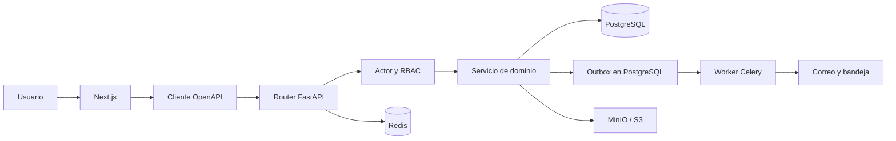

# Guía completa del código de AMVARMAR LMS

Estado leído: 25 de agosto de 2026, actualizado el 2 de septiembre de 2026 (ver sección 12).

Esta guía describe el proyecto nuevo `amvarmarLMS`. No describe como código activo el WMS
legacy de Django: ese sistema solo es el origen de los datos y está conservado en
`amvarmarProduccion-main.zip` y en el repositorio separado `amvarmarProduccion`.

Se excluyen dependencias y artefactos generados (`.venv/`, `node_modules/`, `.next/`, cachés y
binarios). `frontend/src/lib/api/generated.ts` sí se documenta, pero no se explica línea por
línea porque es código generado desde OpenAPI y no se edita manualmente.

## 1. Qué se está construyendo

AMVARMAR LMS es un monolito modular para administrar el expediente completo de una carga
internacional. Reemplaza el modelo legacy centrado en `Warehouse` y su WR por una entidad central
`Shipment`, con UUID estable, número de carga legible, estado logístico, requisitos separados,
documentos privados, despachos y líneas de tiempo inmutables.

Las piezas principales son:

- **Frontend:** Next.js App Router y React. Presenta portal de cliente y panel de Operaciones.
- **API:** FastAPI asíncrono. Es la autoridad de autenticación, permisos y reglas de negocio.
- **Persistencia:** PostgreSQL con SQLAlchemy y migraciones Alembic.
- **Coordinación:** Redis para caché de permisos, rate limiting y broker de Celery.
- **Archivos:** MinIO/S3 privado con URLs firmadas que vencen.
- **Trabajo asíncrono:** Celery procesa el transactional outbox.
- **Notificaciones:** bandeja in-app y correo mediante SMTP/Mailpit.
- **Operación:** Prometheus, Alertmanager, Grafana, respaldos y ensayos de restauración.

## 2. Relación general entre las piezas

El patrón normal de una petición es:

1. Una ruta de `frontend/src/app/` renderiza una pantalla.
2. La pantalla usa un hook de `frontend/src/features/` o llama al cliente API.
3. `frontend/src/lib/api/client.ts` agrega el access token y maneja un posible `401`.
4. Next reescribe `/api/*` hacia FastAPI mediante `frontend/next.config.ts`.
5. Un `router.py` de FastAPI valida HTTP y obtiene el actor autenticado.
6. El router calcula permisos efectivos y llama al servicio del dominio.
7. El servicio aplica reglas, bloqueos y cambios dentro de una transacción PostgreSQL.
8. El router audita, hace `commit` y serializa la respuesta.
9. Si hubo un evento externo, el mismo commit deja una fila en `outbox_events`.
10. Celery procesa esa fila y crea notificaciones o ejecuta otros efectos reintentables.

## 3. Dónde están las vistas y los templates

### Pantallas web

El proyecto nuevo **no usa templates Django para la interfaz web**. Sus equivalentes son:

- `frontend/src/app/**/page.tsx`: páginas y URLs.
- `frontend/src/app/**/layout.tsx`: envoltorios compartidos.
- `frontend/src/components/`: fragmentos reutilizables de interfaz.
- `frontend/src/features/`: consultas, mutaciones y vocabulario de cada dominio.

Los nombres entre paréntesis, como `(auth)` y `(client)`, son route groups de Next.js: organizan
archivos, pero no aparecen en la URL.

### Templates reales

Los únicos templates renderizados en el servidor nuevo son correos Jinja:

- `backend/app/modules/notifications/templates/base.html`: versión HTML del correo.
- `backend/app/modules/notifications/templates/base.txt`: alternativa de texto plano.
- `backend/app/modules/notifications/email.py`: carga y renderiza ambos templates.

Los templates Django antiguos siguen en `amvarmarProduccion/templates/`, pero no participan en
AMVARMAR LMS.

## 4. Modelo de datos y relaciones

### Identidad y permisos

- `users`: identidad, hash de contraseña, estado y versión de autorización.
- `companies`: empresas cliente.
- `company_memberships`: une un usuario cliente con una sola empresa.
- `roles` y `permissions`: catálogo RBAC.
- `role_permissions`: permisos otorgados por cada rol.
- `user_role_assignments`: rol concreto de una persona y su alcance.
- `auth_sessions`: dispositivo/sesión revocable.
- `refresh_tokens`: linaje de refresh tokens rotatorios; solo guarda fingerprints.
- `one_time_tokens`: invitaciones, verificación y recuperación de contraseña.

Un usuario con membership es cliente. Un usuario sin membership y con rol global es personal de
AMVARMAR. No existe `is_staff`.

### Cargas

- `shipment_statuses`: catálogo de estados.
- `shipment_status_transitions`: aristas permitidas y permiso requerido.
- `locations` y `facilities`: origen/destino estructurado y regla de WR.
- `shipments`: expediente central.
- `shipment_references`: factura, WR, PO, tracking, contenedor y BL.
- `shipment_packages`: bultos físicos; reemplaza `PieceWarehouse`.
- `shipment_events`: timeline append-only.
- `shipment_requirements`: pendientes de documento, información, pago o acción.

El estado logístico y lo pendiente son ejes distintos. Una carga puede estar `IN_TRANSIT` y tener
un requisito documental abierto sin que el requisito reemplace su estado.

### Documentos

- `document_types`: catálogo y formatos aceptados por tipo.
- `documents`: metadata del objeto privado y estado de la subida.
- `shipment_documents`: relación muchos-a-muchos entre carga y archivo.
- `system_settings`: límites configurables, entre otros ajustes.

Un documento atraviesa `UPLOADING -> READY`. El requisito documental que ese archivo satisface tiene
su propio estado de negocio, que es otro eje: un documento puede estar `READY` y su requisito `REJECTED`
porque Operaciones no lo aceptó.

### Despachos

- `dispatch_requests`: solicitud y bloqueo optimista por `row_version`.
- `dispatch_request_shipments`: cargas reclamadas; una carga no puede estar en dos solicitudes
  activas.
- `dispatch_events`: historia append-only.
- `dispatch_documents`: documentos propios del despacho.

Crear un despacho mueve las cargas `STORED -> DISPATCH_REQUESTED`. Prepararlo las mueve a
`PREPARING`; completarlo las mueve a `DISPATCHED`. Rechazar o cancelar libera las cargas y las
devuelve a `STORED`.

### Auditoría y notificaciones

- `audit_logs`: bitácora append-only, sanitizada antes de insertar.
- `idempotency_keys`: conserva respuestas de creaciones reintentadas.
- `outbox_events`: efectos externos pendientes, entregados o agotados.
- `notifications`: aviso visible para un usuario.
- `notification_deliveries`: resultado por canal, actualmente IN_APP y EMAIL.
- `legacy_id_map`: correspondencia entre PK vieja y UUID nuevo.
- `legacy_password_pending`: usuarios cuyo PBKDF2 legacy aún no se convirtió a Argon2id.

## 5. Flujos importantes

### Login y refresh

`login/page.tsx` -> `contexto-sesion.tsx` -> `POST /auth/login` -> `auth/router.py` ->
`auth/service.py` -> Argon2/PBKDF2 -> `auth_sessions` + `refresh_tokens`.

El refresh queda en cookie HttpOnly. El access token solo vive en memoria. `client.ts` reintenta
una petición tras `401`; `refresh-mutex.ts` usa Web Locks, BroadcastChannel y una versión no
sensible en localStorage para que dos peticiones o pestañas no roten la misma cookie a la vez.

### Cambio de estado de carga

`transicion-carga.tsx` -> `POST /shipments/{id}/transitions` -> `shipments/router.py` ->
`shipments/service.py`. El servicio bloquea la carga, valida el grafo, permiso, motivo,
`row_version`, WR y requisitos; actualiza la carga, agrega `shipment_event` y publica outbox en la
misma transacción.

### Subida de documentos

`expediente.tsx` -> `features/documentos/consultas.ts`:

1. `presign` reserva metadata y devuelve una URL S3 firmada.
2. El navegador sube el archivo directamente a MinIO/S3.
3. `complete` valida objeto, bytes, MIME, tamaño y SHA-256, y lo deja `READY`.
4. Solo un documento `READY` permite solicitar una URL firmada de descarga.

### Despacho

`despachos/nuevo/page.tsx` lista cargas `STORED`, crea una solicitud con
`Idempotency-Key` y navega al detalle. Las acciones de Operaciones llaman approve, reject,
prepare, complete o cancel. El servicio de despachos reutiliza el motor de transiciones de cargas,
por lo que no existe una vía alternativa que omita timeline o reglas.

### Outbox y notificaciones

Los servicios publican en `outbox_events`. `workers/tasks/outbox.py` reclama con
`FOR UPDATE SKIP LOCKED`; `notifications/handlers.py` traduce el evento; `service.py` crea avisos
in-app y entregas de correo. La bandeja frontend consulta cada minuto y permite marcar uno o todos
como leídos.

### Migración legacy

`infra/backup/traer_legacy.sh` copia un dump por SSH a una base local separada.
`docs/migration/correcciones/` limpia problemas aprobados y deja registro. Después,
`scripts/migrate_legacy.py` lee el esquema Django con psycopg, escribe el LMS con SQLAlchemy y usa
`legacy_id_map` para ser repetible. No sube los archivos: solo registra sus rutas para una etapa
posterior.

## 6. Archivos raíz y documentación

| Archivo | Función |
| --- | --- |
| `README.md` | Portada mínima del repositorio. |
| `CONTEXTO_CODEX.md` | Contexto de arquitectura y reglas; su sección de “estado actual” quedó desactualizada frente al código actual. |
| `PROMPT_CODEX_FRONTEND.md` | Especificación usada para construir la primera etapa del frontend. |
| `documentation/AMVARMAR_LMS_Arquitectura_Tecnica_v1.md` | Diseño técnico base: componentes, tablas, API, seguridad y despliegue. |
| `documentation/security/incident-2026-secrets.md` | Registro del incidente de credenciales del repositorio legacy. |
| `amvarmarProduccion-main.zip` | Copia del sistema Django anterior para consulta/migración; no se ejecuta en el LMS. |

### ADRs

Cada archivo de `docs/adr/` congela una decisión que prevalece sobre la arquitectura inicial:

| Archivo | Decisión |
| --- | --- |
| `0001-catalogo-estados.md` | Estados y transiciones de cargas. |
| `0002-traduccion-estados-legacy.md` | Conversión sin inventar estados viejos. |
| `0003-catalogo-tipos-documento.md` | Documentos, requisitos y responsables. |
| `0004-catalogo-rbac.md` | Roles, permisos y alcances. |
| `0005-regla-miami-wr.md` | WR determinado por facility. |
| `0006-definicion-delivered.md` | Evidencia exigida para DELIVERED. |
| `0007-retencion.md` | Retención, archivado y legal hold. |
| `0008-canales-notificacion.md` | Eventos y canales obligatorios. |
| `0009-limites-archivo.md` | Tamaños, formatos y ZIP. Su enmienda retira el antivirus. |
| `0010-app-movil.md` | Apps nativas posteriores al cutover. |
| `0011-modelo-identidad.md` | Membership para clientes y roles globales para staff. |
| `0012-asistente-virtual.md` | AMVI, herramientas y confirmación de escrituras. |
| `0013-cancelacion-de-despachos.md` | Quién cancela y hasta qué estado. |
| `0014-outbox-sin-estado-processing.md` | Reclamo por lock, sin estado PROCESSING persistente. |
| `0015-observabilidad-y-respaldos.md` | Métricas, alertas, RPO y RTO. |
| `_template.md` | Estructura para nuevas decisiones. |

### Migración y runbooks

- `docs/migration/COMO_EMPEZAR.md`: orden operativo para preparar y ejecutar la migración.
- `docs/migration/inventario.sql`: inventario determinista del esquema viejo.
- `docs/migration/check_archivos.py`: verifica que los FileField legacy existan en disco.
- `docs/migration/diagnostico_5_1.sql`: diagnóstico previo a corregir datos.
- `docs/migration/correcciones/000_registro.sql`: tabla de trazabilidad de correcciones.
- `001_emails.sql`: corrige correos vacíos/duplicados según decisiones.
- `002_cargas_sin_cliente.sql`: asigna o deja documentadas cargas ambiguas.
- `003_wr_formato.OMITIDO.md`: explica por qué el WR no se corrige en la base vieja.
- `999_revertir.sql`: revierte las correcciones aplicadas.
- `correcciones/local/decisiones_locales.sql`: decisiones específicas no versionables del ambiente.
- `correcciones/README.md`: contrato y orden de esos scripts.
- `docs/runbooks/*.md`: respuesta operativa para API, base, correo, malware, 5xx, login,
  latencia, outbox, restauración, refresh reuse y storage.

## 7. Backend, archivo por archivo

### Entrada y núcleo transversal

| Archivo | Función y relaciones |
| --- | --- |
| `app/main.py` | Crea FastAPI, configura logs/métricas/trazas/errores y monta todos los routers. |
| `app/api/health.py` | `/health/live` y `/health/ready`; el segundo verifica PostgreSQL y Redis. |
| `app/core/config.py` | Lee `.env` con Pydantic y concentra tiempos, claves, storage, correo y observabilidad. |
| `app/core/database.py` | Base SQLAlchemy, UUID, TIMESTAMPTZ, engine, sessionmaker y sesión por request. |
| `app/core/redis.py` | Pool Redis y dependencia de FastAPI. |
| `app/core/errors.py` | Jerarquía de errores y respuesta uniforme `{error:{...}}`. |
| `app/core/logging.py` | Configura structlog JSON y contexto de request ID. |
| `app/core/middleware.py` | Genera/valida request ID y escribe el log de acceso. |
| `app/core/pagination.py` | Cursor opaco sobre fecha+UUID y límite máximo. |
| `app/core/rate_limit.py` | Ventanas Redis para login, refresh y recuperación. |
| `app/core/idempotency.py` | Reserva `Idempotency-Key`, compara hash del body y devuelve respuestas previas. |

### Seguridad

| Archivo | Función y relaciones |
| --- | --- |
| `core/security/argon2.py` | Hash Argon2id, verificación PBKDF2 Django y rehash progresivo. |
| `core/security/jwt.py` | Emite y valida access/refresh con issuer, audience, expiración, tipo, SID y JTI. |
| `core/security/token_fingerprint.py` | HMAC-SHA-256 de refresh y one-time tokens; nunca guarda el secreto completo. |

### Observabilidad

| Archivo | Función y relaciones |
| --- | --- |
| `core/observability/http.py` | Middleware de conteo y duración HTTP por plantilla de ruta. |
| `core/observability/metrics.py` | Define métricas Prometheus y refresca gauges desde PostgreSQL con caché. |
| `core/observability/router.py` | Publica `/metrics` protegido por token. |
| `core/observability/tracing.py` | Activa OpenTelemetry para FastAPI/SQLAlchemy cuando hay endpoint OTLP. |

### Identidad, autenticación y RBAC

| Archivo | Función y relaciones |
| --- | --- |
| `modules/users/models.py` | Modelo `User`; no tiene `is_staff`. |
| `modules/companies/models.py` | `Company` y membresía única por usuario. |
| `modules/auth/models.py` | Sesiones, refresh rotatorio y tokens de un uso. |
| `modules/auth/schemas.py` | Payloads/respuestas públicos; excluye hashes y refresh. |
| `modules/auth/dependencies.py` | Decodifica bearer, confirma sesión activa y produce `Actor`. |
| `modules/auth/service.py` | Login, rehash, sesiones, rotación atómica, reuse detection, logout y reset. |
| `modules/auth/router.py` | Endpoints auth, cookie HttpOnly, rate limits, auditoría y `/me`. |
| `modules/rbac/models.py` | Roles, permisos, asignaciones y checks de scope. |
| `modules/rbac/catalog.py` | Fuente única de permisos, roles y matriz. |
| `modules/rbac/service.py` | Calcula permisos efectivos y los cachea por `authz_version`. |
| `modules/rbac/dependencies.py` | Fábrica antigua de dependencia `require_permission`; conserva un actor placeholder y actualmente los routers activos no la usan. |

### Administración

| Archivo | Función y relaciones |
| --- | --- |
| `modules/admin/router.py` | API para listar/crear/editar/desactivar empresas y usuarios. |
| `modules/admin/service.py` | Aplica alcance RBAC, memberships, roles, desactivación y reset administrativo. |

Interfaz frontend en `app/(admin)/empresas/page.tsx` y `app/(admin)/usuarios/page.tsx`.

### Auditoría y outbox

| Archivo | Función y relaciones |
| --- | --- |
| `modules/audit/models.py` | AuditLog, IdempotencyKey y OutboxEvent. |
| `modules/audit/redaction.py` | Redacta claves sensibles en estructuras anidadas. |
| `modules/audit/service.py` | Inserta auditoría después de redacción obligatoria. |
| `modules/audit/outbox.py` | Publica, reclama, reintenta con backoff y agota eventos. |
| `modules/audit/legacy.py` | Mapa de IDs y seguimiento de hashes legacy pendientes. |

### Cargas

| Archivo | Función y relaciones |
| --- | --- |
| `modules/shipments/models.py` | Todas las tablas y enums de carga, referencias, paquetes, eventos y requisitos. |
| `modules/shipments/catalog.py` | Fuente única del grafo de estados/transiciones. |
| `modules/shipments/policies.py` | Reglas de WR según facility. |
| `modules/shipments/gestion.py` | Alta y PATCH de cargas sin permitir cambiar estado por esa vía. |
| `modules/shipments/service.py` | Motor transaccional de estados y requisitos; escribe timeline y outbox. |
| `modules/shipments/queries.py` | Listado, detalle, timeline y dashboard con aislamiento en SQL. |
| `modules/shipments/router.py` | Contrato HTTP para CRUD, transiciones, requisitos y lecturas. |
| `modules/shipments/dashboard_router.py` | Dashboards cliente/operaciones reutilizando `queries.py`. |
| `modules/shipments/peso.py` | Conversión canónica kg/lb con `Decimal` y redondeo uniforme a tres decimales. |

### Documentos

| Archivo | Función y relaciones |
| --- | --- |
| `modules/documents/models.py` | Tipos, documentos, vínculos y system settings. |
| `modules/documents/catalog.py` | Siete tipos aprobados, formatos y estado antes del cual son obligatorios. |
| `modules/documents/validation.py` | Sanea nombres y valida extensión, MIME real y tamaño. |
| `modules/documents/service.py` | Presign/complete/download y expediente documental. |
| `modules/documents/router.py` | Autoriza empresa y expone las operaciones documentales. |
| `infrastructure/storage/s3.py` | Cliente boto3, bucket privado y URLs firmadas. |

### Despachos

| Archivo | Función y relaciones |
| --- | --- |
| `modules/dispatches/models.py` | Solicitud, cargas reclamadas, eventos y documentos. |
| `modules/dispatches/service.py` | Orquesta solicitud+cargas en una transacción y reutiliza ShipmentService. |
| `modules/dispatches/router.py` | Crear/listar/detallar y acciones; idempotencia, RBAC y auditoría. |

### Notificaciones

| Archivo | Función y relaciones |
| --- | --- |
| `modules/notifications/models.py` | Avisos y entregas por canal. |
| `modules/notifications/catalog.py` | Texto fijo, criticidad y ruta de cada evento notificable. |
| `modules/notifications/handlers.py` | Convierte eventos del outbox en avisos a destinatarios. |
| `modules/notifications/service.py` | Deduplicación, bandeja, lectura y entrega IN_APP/EMAIL. |
| `modules/notifications/email.py` | Compone Jinja y envía por aiosmtplib. |
| `modules/notifications/router.py` | Lista avisos propios y los marca leídos. |
| `notifications/templates/base.html` | Correo HTML. |
| `notifications/templates/base.txt` | Correo texto plano. |

### Asistente virtual

| Archivo | Función y relaciones |
| --- | --- |
| `modules/copilot/prompts.py` | System prompt contextual de AMVI. |
| `modules/copilot/tools.py` | Esquemas de herramientas y filtro por permisos; no ejecuta aún un proveedor. |

### Workers y scripts

| Archivo | Función y relaciones |
| --- | --- |
| `workers/app.py` | Crea Celery sobre Redis e incluye tareas de scan/outbox. |
| `workers/tasks/outbox.py` | Liga tipos de evento a handlers y confirma el lote. |
| `scripts/seed_rbac.py` | Sincroniza permisos, roles y matriz de forma idempotente. |
| `scripts/seed_shipment_statuses.py` | Siembra estados y transiciones desde el catálogo. |
| `scripts/seed_document_types.py` | Siembra tipos documentales. |
| `scripts/seed_demo.py` | Crea datos navegables solo en ambiente local; puede limpiarlos. |
| `scripts/migrate_legacy.py` | Migra empresas, usuarios, cargas, bultos, despachos y metadata documental. |

Los `__init__.py` están vacíos salvo el de security; marcan paquetes Python y no contienen lógica.

## 8. Migraciones Alembic

| Revisión | Qué crea o modifica |
| --- | --- |
| `d62ea549f5a9` | Extensiones pgcrypto y citext. |
| `ebf59dd9d030` | Users, companies y memberships. |
| `a124aa9f2682` | RBAC. |
| `2741d14a0953` | Auth sessions y refresh tokens. |
| `e822495b9f01` | Auditoría, idempotencia, outbox y one-time tokens. |
| `ac24538a8300` | Núcleo Shipment, locations/facilities y secuencia SHP. |
| `44eefa4e0d2e` | Referencias, paquetes y timeline inmutable. |
| `337d2e12aa48` | Tipos y requisitos documentales. |
| `291dfb45b917` | Documents, vínculos y system settings. |
| `62dae444e5c2` | Despachos, eventos, documentos y secuencia DSP. |
| `99010939fc42` | Estado, deduplicación e índices del outbox. |
| `f6d833ce5fed` | Notificaciones y entregas. |
| `f28bcab77643` | Mapeo de migración y passwords legacy pendientes. |
| `d82146036c33` | Campos comerciales del sistema legacy y ocultamiento de cargas. |
| `d98e024bf210` | Preferencias de columnas por usuario. |
| `1f93eb9be376` | Retira el escaneo antivirus de documentos. |
| `8d73b0b79c53` | Retira `PICKUP` de los métodos de despacho (ADR-0016). |
| `f9329a7c5d0f` | Piezas obligatorias y `package_count` consistente. |
| `4c2a6e91d7b8` | Peso canónico (fuente kg/lb) y búsqueda de referencias (índices trigram). |
| `7a31c4f09d22` | Contexto y seguridad documental (`provided_by` vs `issued_by`). |
| `6f0f9c2be8d1` | Salida física del despacho (`DISPATCHED` alcanzable). |
| `d8e4f7a12c30` | Trabajos de exportación documental (ZIP asíncrono). |

`backend/alembic/env.py` importa todos los modelos para que autogenerate/check conozcan el esquema.
`alembic.ini`, `alembic/README` y `script.py.mako` configuran el entorno y plantilla de revisiones.

## 9. Frontend, archivo por archivo

### Configuración y base

| Archivo | Función |
| --- | --- |
| `package.json` | Scripts y dependencias Next/React/Query/Zod/OpenAPI. |
| `next.config.ts` | Proxy `/api` hacia FastAPI. |
| `postcss.config.mjs` | Plugin Tailwind para PostCSS. |
| `eslint.config.mjs` | Reglas de lint de Next. |
| `tsconfig.json` | TypeScript estricto y alias `@/*`. |
| `.env.example` | Variables públicas/proxy sin secretos. |
| `src/app/globals.css` | Tokens de color, tipografía y accesibilidad global. |
| `src/app/icon.png` | Ícono de aplicación. |
| `public/brand/amvarmar-isotipo.png` | Activo visual usado en login y navegación. |

### Rutas

| Ruta | Archivo | Función |
| --- | --- | --- |
| `/` | `app/page.tsx` | Redirige a `/dashboard`. |
| Auth compartido | `app/(auth)/layout.tsx` | Envuelve formularios con branding. |
| `/login` | `app/(auth)/login/page.tsx` | Formulario Zod/RHF y redirección según tipo de usuario. |
| `/recuperar-contrasena` | `.../recuperar-contrasena/page.tsx` | Solicita enlace sin revelar si existe la cuenta. |
| `/restablecer-contrasena` | `.../restablecer-contrasena/page.tsx` | Consume token y exige 12 caracteres. |
| Portal compartido | `app/(client)/layout.tsx` | Protege sesión y monta PortalShell. |
| `/dashboard` | `.../dashboard/page.tsx` | Pendientes y dashboard del cliente. |
| `/shipments` | `.../shipments/page.tsx` | Filtros y paginación cursor de cargas. |
| `/shipments/[id]` | `.../shipments/[id]/page.tsx` | Detalle, documentos, hitos, transición y timeline. |
| `/despachos` | `.../despachos/page.tsx` | Lista y filtra solicitudes. |
| `/despachos/nuevo` | `.../despachos/nuevo/page.tsx` | Selecciona cargas STORED y crea despacho. |
| `/despachos/[id]` | `.../despachos/[id]/page.tsx` | Progreso y acciones según cliente/Operaciones. |
| `/avisos` | `.../avisos/page.tsx` | Bandeja completa y filtros leído/no leído. |
| `/sesiones` | `.../sesiones/page.tsx` | Dispositivos activos, revocación y logout-all. |
| Admin compartido | `app/(admin)/layout.tsx` | También protege y monta PortalShell. |
| `/operaciones` | `app/(admin)/operaciones/page.tsx` | Dashboard global; devuelve clientes a `/dashboard`. |

### Componentes

| Archivo | Función |
| --- | --- |
| `components/proveedores.tsx` | QueryClient + proveedor global de sesión. |
| `components/auth/contenedor-auth.tsx` | Composición visual de formularios auth. |
| `components/layout/portal-shell.tsx` | Sidebar, header, navegación, campana y menú de usuario. |
| `components/dashboard/dashboard-cargas.tsx` | Cinco métricas y próximos movimientos. |
| `components/dashboard/que-hacer.tsx` | Prioriza acciones del cliente antes del dashboard. |
| `components/shipments/filtros-cargas.tsx` | Búsqueda, múltiples estados y rango ETA. |
| `components/shipments/listado-cargas.tsx` | Filas responsivas de carga. |
| `components/shipments/badges-carga.tsx` | Estado y pendientes como badges separados. |
| `components/shipments/estado-explicado.tsx` | Explica estado actual y siguiente acción. |
| `components/shipments/timeline-carga.tsx` | Eventos con cursor y marca registros tardíos. |
| `components/shipments/transicion-carga.tsx` | Modal de cambio de estado y conflicto de versión. |
| `components/documentos/expediente.tsx` | Requisitos, selector, subida directa y descarga. |
| `components/despachos/insignia-despacho.tsx` | Etiqueta visual del estado de despacho. |
| `components/despachos/pasos-despacho.tsx` | Indicador lineal del progreso. |
| `components/notificaciones/campana.tsx` | Vista corta, contador y marcado como leído. |
| `components/ui/boton.tsx` | Botón con variantes y estado cargando. |
| `components/ui/campo.tsx` | Input/textarea accesibles con error. |
| `components/ui/modal.tsx` | Diálogo reutilizable, cierre con Escape. |
| `components/ui/aviso-error.tsx` | Traduce ErrorApi; solo muestra request ID en 5xx. |
| `components/ui/estados-pagina.tsx` | Loading y empty state. |

### Estado, API y features

| Archivo | Función |
| --- | --- |
| `features/auth/contexto-sesion.tsx` | Bootstrap de sesión, login/logout y permisos para adaptar UI. |
| `features/auth/portal-protegido.tsx` | Redirige anónimos conservando URL de regreso. |
| `lib/api/client.ts` | Cliente OpenAPI, bearer, retry tras refresh y error único. |
| `lib/api/token-store.ts` | Access token en memoria y sincronización entre pestañas. |
| `lib/api/refresh-mutex.ts` | Exclusión mutua de refresh dentro y entre pestañas. |
| `lib/api/refresh-mutex.test.ts` | Prueba concurrencia y reutilización de promesa. |
| `lib/api/generated.ts` | Contrato generado desde `/openapi.json`; no editar a mano. |
| `lib/api/tipos.ts` | Alias legibles sobre schemas generados. |
| `lib/query-client.ts` | Política global de caché/reintentos TanStack Query. |
| `lib/utilidades.ts` | Clases, fechas CR, iniciales y tiempo relativo. |
| `features/shipments/catalogo-estados.ts` | Orden y etiquetas de estados. |
| `features/shipments/vocabulario.ts` | Explicaciones para clientes. |
| `features/documentos/consultas.ts` | Expediente y flujo presign/PUT/complete/download. |
| `features/documentos/vocabulario.ts` | Textos de requisitos, scan y disponibilidad. |
| `features/despachos/catalogo.ts` | Estados, tonos, explicaciones y métodos. |
| `features/despachos/consultas.ts` | Hooks de listado, detalle y todas las acciones. |
| `features/notificaciones/consultas.ts` | Polling, lectura individual y masiva. |
| `features/notificaciones/rutas.ts` | Convierte resource_type a ruta del frontend. |

## 10. Infraestructura

| Archivo | Función |
| --- | --- |
| `infra/docker/docker-compose.yml` | PostgreSQL nuevo, Redis, MinIO, Mailpit; perfiles legacy y observabilidad. |
| `infra/backup/respaldar.sh` | pg_dump custom, SHA-256, retención y métricas Pushgateway. |
| `infra/backup/ensayar_restauracion.sh` | Restaura el último dump, compara tablas y mide RTO. |
| `infra/backup/traer_legacy.sh` | Copia por SSH y restaura el sistema viejo en una base separada. |
| `infra/observability/prometheus.yml` | Scraping y carga de reglas. |
| `infra/observability/alertas.yml` | Alertas de disponibilidad, seguridad, outbox y respaldos. |
| `infra/observability/alertmanager.yml` | Agrupación, inhibición y destinos de alertas. |
| `backend/Dockerfile` | Imagen de producción del API. |
| `backend/.env.example` | Contrato de configuración con placeholders. |
| `backend/requirements*.txt` | Instalación alternativa fijada para runtime/desarrollo. |
| `backend/pyproject.toml` | Dependencias, Ruff, mypy, pytest, coverage y Bandit. |

## 11. Pruebas

`backend/tests/conftest.py` levanta PostgreSQL, Redis y MinIO reales con testcontainers, aplica
Alembic y aísla cada prueba. Las pruebas no usan SQLite porque el sistema depende de funciones
propias de PostgreSQL.

| Archivo | Cobertura principal |
| --- | --- |
| `integration/test_database.py` | Extensiones, UUID, CITEXT y tipos. |
| `integration/test_identidad.py` | Users, companies, membership y constraints. |
| `integration/test_rbac.py` | Seed, matriz, scopes, 404 y caché. |
| `integration/test_auth_endpoints.py` | Contrato HTTP auth, cookies, sesiones y request ID. |
| `integration/test_admin.py` | Administración y aislamiento. |
| `integration/test_shipment_catalogo.py` | Grafo y seed de estados. |
| `integration/test_shipments.py` | Esquema y concurrencia de cargas. |
| `integration/test_shipment_referencias.py` | CRUD, WR y referencias. |
| `integration/test_transiciones.py` | Motor, versiones, permisos, auditoría y carreras. |
| `integration/test_listados_dashboard.py` | Aislamiento, cursores, filtros y métricas. |
| `integration/test_shipments_http.py` | Contrato HTTP de cargas. |
| `integration/test_requisitos_documentales.py` | Catálogo, bloqueos y exoneración. |
| `integration/test_documentos_http.py` | Presign/complete/download/expediente por HTTP. |
| `integration/test_despachos.py` | Ciclo, doble reclamo y cancelación. |
| `integration/test_outbox.py` | Locks, dedup, backoff y agotamiento. |
| `integration/test_notificaciones.py` | Catálogo, SMTP, dedup y flujo desde outbox. |
| `integration/test_notificaciones_http.py` | Bandeja propia, cursor y lectura. |
| `integration/test_observabilidad.py` | Token de métricas, gauges y middleware. |
| `integration/test_objetivos_no_funcionales.py` | Rendimiento, concurrencia y metas cuantitativas. |
| `security/test_argon2.py` | Argon2id, PBKDF2 y rehash progresivo. |
| `security/test_jwt.py` | Claims, tipos, firma, audiencia y expiración. |
| `security/test_auth_sessions.py` | Rotación, revocación, reuse y carreras. |
| `security/test_auditoria.py` | Redacción e idempotencia. |
| `security/test_documentos_upload.py` | MIME, nombres hostiles, límites y acceso privado. |
| `security/test_copilot_tools.py` | Herramientas filtradas por permisos. |
| `migration/test_correcciones_legacy.py` | Diagnóstico, correcciones, idempotencia y reversión. |
| `migration/legacy_schema.sql` | Esquema mínimo Django usado en esas pruebas. |
| `migration/legacy_seed.sql` | Datos sucios reproducibles para probar limpieza. |

Los `__init__.py` de pruebas solo marcan paquetes.

## 12. Hallazgos importantes del estado actual

Estado leído: 2 de septiembre de 2026, tras la verificación operativa registrada en
`docs/reescritura/06-implementacion-y-verificacion.md`. Ver ese documento para evidencia y conteos
exactos.

Resuelto desde la lectura anterior (25 de agosto de 2026):

1. **`backend/app/infrastructure/storage/`.** `.gitignore` ahora tiene una excepción explícita
   (`!backend/app/infrastructure/storage/` y `/**`) para el código fuente; un clon nuevo sí recibe
   `storage/s3.py` y `storage/__init__.py`.
2. **Rutas de correo.** `notifications/catalog.py` usa `/shipments/{id}` y `/sesiones` en todos los
   eventos; no quedan rutas `/cargas/{id}` ni `/cuenta/seguridad`.
3. **La API admin ya tiene interfaz.** `app/(admin)/empresas/page.tsx` y
   `app/(admin)/usuarios/page.tsx` existen y están montadas bajo `PortalShell`.
4. **Estado de usuario `DISABLED` inexistente.** `ActualizarUsuarioRequest.status` en
   `admin/router.py` aceptaba `DISABLED`, un valor que el `CHECK` de `users.status`
   (`INVITED`, `ACTIVE`, `SUSPENDED`) nunca tuvo; una actualización con ese valor rompía en el
   `UPDATE` con un error de integridad no controlado. Corregido: el patrón ahora es
   `^(ACTIVE|SUSPENDED)$` y `admin/service.py` ya no referencia `DISABLED`.
5. **Migrador legacy.** `scripts/migrate_legacy.py` (1249 líneas) existe y migra empresas, usuarios,
   cargas, bultos, despachos y metadata documental; no es un paso pendiente.

Siguen abiertos, y quedan fuera de esta corrección porque tocan la política de contraseñas o
exceden el alcance de un defecto puntual:

6. **La administración contradice la política de invitaciones.** `admin/service.py` genera y
   devuelve contraseñas temporales en `UsuarioCreadoResponse.password_temporal`, aunque la
   arquitectura pide enlaces de invitación de un solo uso. Es parte de la política administrativa de
   contraseñas, fuera de alcance de la reescritura operativa.
7. **Recuperación todavía no entrega el enlace.** `password_forgot` crea el token, pero no publica
   un evento de outbox ni manda el correo. Mismo motivo: es flujo de autenticación, fuera de alcance.
8. **`rbac/dependencies.py` quedó obsoleto.** Su `_user_id_actual()` siempre responde 401. No rompe
   los routers actuales porque estos usan `auth.dependencies.actor_actual`, pero no debe reutilizarse
   sin actualizarlo. Es código de autenticación; no se toca en esta corrección.
9. **Los hooks de acciones de despacho no envían `row_version`.** El backend lo acepta como
   opcional, por lo que esas acciones no aprovechan el bloqueo optimista que sí muestra el detalle
   de carga. No es una regresión de datos (el backend sigue siendo la fuente de verdad), es una
   mejora de UX pendiente.
10. **La observabilidad asume servicios externos.** Prometheus apunta a `backend:8000` y a exporters
    que no están definidos en este compose; esa topología debe completarse en el despliegue.

## 13. Regla para orientarse al modificar algo

- Cambio visual: ruta `app/` o componente `components/`.
- Nueva llamada: hook en `features/`, usando tipos de `generated.ts`.
- Cambio de contrato HTTP: schema/router backend, regenerar OpenAPI y `generated.ts`.
- Regla de negocio: service/policy del módulo, no el router ni React.
- Cambio de tabla: model + nueva migración Alembic + prueba de upgrade/downgrade.
- Nuevo permiso: ADR-0004 + `rbac/catalog.py` + seed + matriz de pruebas.
- Nuevo estado de carga: ADR-0001 + `shipments/catalog.py` + seed + pruebas.
- Efecto externo: outbox + handler idempotente; nunca correo directo desde el modelo.
- Archivo: acceso privado S3, validación del tipo real por los bytes y URLs firmadas que vencen.

