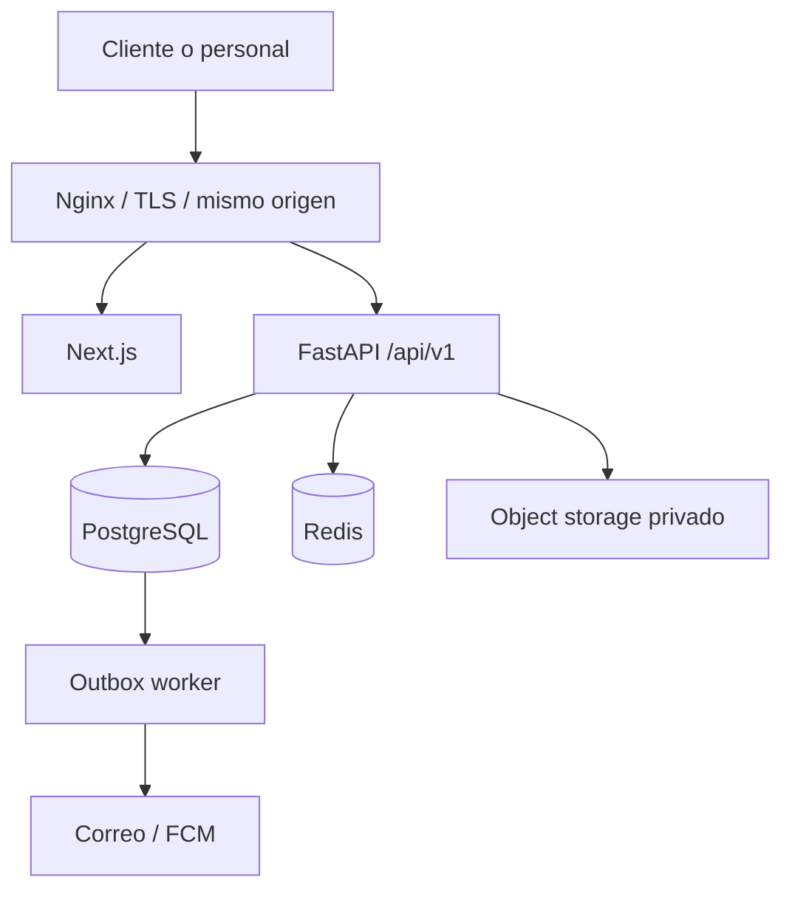
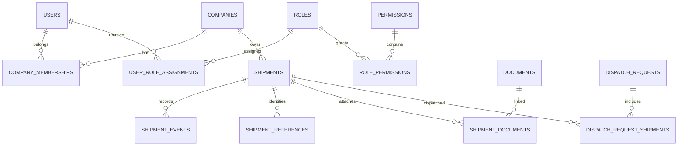

# AMVARMAR LMS — Arquitectura y documentación técnica inicial

**Versión:** 1.0  
**Fecha:** 17 de agosto de 2026  
**Estado:** Propuesta para iniciar desarrollo  
**Arquitectura objetivo:** FastAPI asíncrono + PostgreSQL + Next.js/TypeScript  

---

## 0. Resumen ejecutivo

AMVARMAR ya posee un WMS en Django 5.2 + Django REST Framework + PostgreSQL. El nuevo proyecto no debe limitarse a cambiar de framework: debe transformar el modelo centrado en `Warehouse/WR` en un **LMS centrado en el expediente de carga (`Shipment`)**.

Cada carga tendrá un identificador estable, por ejemplo `SHP-2026-001284`, y evolucionará mediante una línea de tiempo auditable:

`PRE_ALERT → IN_TRANSIT → RECEIVED → STORED → DISPATCH_REQUESTED → PREPARING → DISPATCHED → DELIVERED`

Las condiciones como “faltan documentos”, “requiere acción” o “retrasada” no deben reemplazar el estado logístico principal. Se modelarán como requisitos, incidencias o acciones abiertas. Así una carga puede estar `IN_TRANSIT` y, al mismo tiempo, requerir una factura del cliente.

La solución recomendada es un **monolito modular**, no microservicios. FastAPI expone una API REST versionada; PostgreSQL conserva la integridad y las transacciones; Redis apoya caché, rate limiting y cola; un worker ejecuta notificaciones y procesamiento de archivos mediante un patrón transactional outbox; Next.js ofrece el portal de clientes y administración.

### Decisiones principales

- UUID como PK interna; códigos legibles únicamente como identificadores de negocio.
- `shipment_number` sustituye al WR como identidad de la carga.
- Factura es la referencia general; WR es opcional y solamente corresponde a operaciones de Miami.
- RBAC real mediante roles, permisos y asignaciones con alcance global o por empresa.
- Argon2id para contraseñas; nunca enviar contraseñas temporales por correo.
- Access JWT corto y refresh JWT rotatorio con persistencia, revocación y detección de reutilización.
- El refresh token viaja en cookie `HttpOnly + Secure`; el access token se mantiene en memoria del frontend.
- Auditoría append-only de operaciones sensibles, sin tokens, contraseñas ni archivos.
- Archivos privados en object storage; en PostgreSQL solo se guardan metadatos y relaciones.
- Migraciones con Alembic y transacciones explícitas para cambios de estado y rotación de tokens.
- Todas las fechas se almacenan como `TIMESTAMPTZ` en UTC y se presentan en `America/Costa_Rica`.

---

## 1. Estado actual y restricciones de migración

La revisión de `amvarmarProduccion-main.zip` muestra:

| Área | Estado actual | Decisión para el LMS |
|---|---|---|
| Backend | Django + DRF; no FastAPI | Crear backend FastAPI nuevo y migrar por etapas. |
| Base de datos | PostgreSQL; existe migración previa desde SQLite | Conservar PostgreSQL, pero crear un esquema relacional nuevo y normalizado. |
| Identidad de carga | `Warehouse.wr_number` es PK y obligatorio | UUID interno + `shipment_number`; WR pasa a referencia opcional. |
| Estados | `PENDIENTE/APROBADO/RECHAZADO/COMPLETADO` se reutilizan en bodega y despacho | Separar estados de carga, despacho, requisitos y documentos. |
| Autorización | `is_staff` frente a cliente | Sustituir por RBAC granular y alcance por empresa. |
| JWT | Access 30 min, refresh 7 días; rotación desactivada | Access 10 min; refresh rotatorio; revocación y reuse detection. |
| Sesiones | No existe registro propio de sesiones JWT | Tablas `auth_sessions` y `refresh_tokens`. |
| Auditoría | Logging mínimo de requests; no hay bitácora de negocio | `audit_logs` append-only y `shipment_events/dispatch_events`. |
| Archivos | Filesystem local; MIME inferido; ZIP extraído en memoria | Object storage privado, límites, checksum, inspección y antivirus. |
| Notificaciones | Correo/push disparados después del commit | Transactional outbox + worker con reintentos e idempotencia. |
| Clientes | `ClientProfile` vincula un usuario con una empresa | `company_memberships`, compatible con varios usuarios por empresa. |
| Dashboard | Conteos genéricos de warehouses/despachos | En bodega, en tránsito, próximos a llegar, requieren acción y entregados este mes. |

### Hallazgo crítico previo al desarrollo

El archivo `.env.example` adjunto contiene valores que parecen credenciales reales de base de datos y correo. Antes de reutilizar el repositorio se debe:

1. Rotar inmediatamente todas las credenciales expuestas.
2. Sustituirlas por placeholders en `.env.example`.
3. Revocar sesiones o integraciones que dependan de esos secretos.
4. Eliminar los secretos del historial Git con un procedimiento controlado.
5. Activar secret scanning en CI y en el repositorio remoto.
6. Verificar logs y accesos posteriores a la primera exposición conocida.

No se deben copiar esos valores al proyecto nuevo.

---

## 2. Arquitectura propuesta

### 2.1 Estilo arquitectónico

Se recomienda un **monolito modular con arquitectura por dominios**:

- Un solo despliegue de API al inicio.
- Un solo PostgreSQL como fuente de verdad.
- Módulos con límites claros y dependencias controladas.
- Worker separado para tareas asíncronas.
- Posibilidad de extraer un módulo como servicio solo cuando exista una necesidad real de escala u operación independiente.

Esto reduce complejidad operativa y permite mantener transacciones fuertes entre cargas, documentos y despachos.



### 2.2 Componentes

#### Backend

- **FastAPI** para API REST y OpenAPI.
- **SQLAlchemy 2.x async** como ORM.
- **asyncpg** como driver PostgreSQL.
- **Alembic** para migraciones.
- **Pydantic Settings** para configuración validada.
- **pwdlib[argon2]** para Argon2id.
- **PyJWT[crypto]** para JWT firmados.
- **Redis** para rate limiting, caché de permisos y coordinación de tareas.
- **Worker** (Celery o equivalente) para outbox, correo, FCM, antivirus y procesamiento de archivos.
- **S3-compatible object storage** para documentos privados; MinIO puede utilizarse localmente.

SQLAlchemy indica que cada `AsyncSession` es mutable y no debe compartirse entre tareas concurrentes. La aplicación creará una sesión por request o unidad de trabajo y evitará lazy loading implícito en código async. Véase la [documentación oficial de SQLAlchemy asyncio](https://docs.sqlalchemy.org/en/latest/orm/extensions/asyncio.html).

#### Frontend recomendado

**Next.js App Router + TypeScript + Tailwind CSS**.

Complementos:

- TanStack Query para caché, reintentos e invalidación de datos de API.
- React Hook Form + Zod para formularios y validación de experiencia de usuario.
- Cliente generado desde OpenAPI con Orval u `openapi-typescript` para evitar contratos duplicados.
- Componentes accesibles basados en Radix UI/shadcn, con estilos propios de AMVARMAR.
- Vitest + Testing Library para pruebas unitarias; Playwright para E2E.

Next.js se acopla bien porque el backend sigue siendo la autoridad de datos y permisos. El frontend nunca determina si una operación está autorizada: únicamente adapta la interfaz; FastAPI verifica cada request.

#### Integración y red

En producción se recomienda un único origen:

- `https://app.amvarmar.com/` → Next.js.
- `https://app.amvarmar.com/api/v1/` → FastAPI.
- `https://app.amvarmar.com/media/...` no debe exponer el filesystem; los documentos se entregan con URL firmada corta o streaming autorizado.

Nginx enruta por path. Este diseño disminuye la complejidad de CORS y cookies. Si el frontend y API se separan en dominios diferentes, CORS debe utilizar una allowlist exacta y nunca `*` con credenciales.

### 2.3 Capas internas del backend

| Capa | Responsabilidad | No debe hacer |
|---|---|---|
| API/router | HTTP, dependencias, status codes, serialización | Reglas de negocio o consultas extensas. |
| Schemas | Validar payloads y respuestas | Acceder a DB. |
| Service/use case | Orquestar reglas, permisos y transacciones | Conocer detalles HTTP. |
| Repository/selectors | Persistencia y consultas optimizadas | Autorizar por sí solo. |
| Domain/policies | Estados, transiciones e invariantes | Depender de FastAPI. |
| Models | Mapeo relacional | Enviar correos o ejecutar efectos externos. |
| Worker/outbox | Efectos externos reintentables | Cambiar datos sin idempotencia. |

### 2.4 Flujo transaccional de ejemplo

Al cambiar una carga a `RECEIVED`:

1. El endpoint valida el payload y exige `shipments.status.transition`.
2. El servicio abre una transacción y bloquea la carga con `SELECT ... FOR UPDATE`.
3. La política verifica que la transición actual → nueva sea permitida.
4. Actualiza `shipments.current_status_code` y `received_at`.
5. Inserta un `shipment_event` append-only.
6. Inserta un `audit_log` sanitizado.
7. Inserta un `outbox_event` para notificar al cliente.
8. Hace commit una sola vez.
9. El worker procesa el outbox, envía correo/push y registra el resultado.

Si falla cualquiera de los pasos 2–7, no se persiste un estado parcial.

---

## 3. Modelo de base de datos PostgreSQL

### 3.1 Convenciones

- Nombres de tablas y columnas: `snake_case`, plural para tablas.
- PK: `UUID`, generada con `gen_random_uuid()`.
- Fechas: `TIMESTAMPTZ`, siempre UTC.
- Correos: `CITEXT` para unicidad case-insensitive.
- Montos/pesos: `NUMERIC`, nunca `FLOAT`.
- Borrado lógico solo cuando sea necesario: `deleted_at`; registros de auditoría y eventos no se borran.
- Cada tabla tenant-owned incluye `company_id`.
- Todas las FKs se indexan cuando participan en consultas o filtros.
- `ON DELETE RESTRICT` para información histórica; `CASCADE` solamente en tablas puramente asociativas.
- `JSONB` se reserva para metadatos variables, snapshots y payloads; no sustituye relaciones centrales.
- El rol de aplicación no tendrá permiso `DELETE/UPDATE` sobre auditoría y eventos append-only.

Extensiones:

```sql
CREATE EXTENSION IF NOT EXISTS pgcrypto;
CREATE EXTENSION IF NOT EXISTS citext;
```

### 3.2 Diagrama relacional de alto nivel



### 3.3 Identidad, empresas y RBAC

#### `users`

| Columna | Tipo | Reglas |
|---|---|---|
| `id` | UUID | PK, `DEFAULT gen_random_uuid()` |
| `email` | CITEXT | `NOT NULL`, `UNIQUE` |
| `password_hash` | VARCHAR(255) | `NOT NULL`; Argon2id o hash legacy durante migración |
| `first_name` | VARCHAR(100) | `NOT NULL` |
| `last_name` | VARCHAR(150) | `NOT NULL` |
| `phone` | VARCHAR(32) | NULL |
| `status` | VARCHAR(20) | `NOT NULL`, CHECK: `INVITED, ACTIVE, SUSPENDED, DISABLED` |
| `must_change_password` | BOOLEAN | `NOT NULL DEFAULT FALSE` |
| `email_verified_at` | TIMESTAMPTZ | NULL |
| `failed_login_attempts` | SMALLINT | `NOT NULL DEFAULT 0`, CHECK `>= 0` |
| `locked_until` | TIMESTAMPTZ | NULL |
| `password_changed_at` | TIMESTAMPTZ | NULL |
| `authz_version` | INTEGER | `NOT NULL DEFAULT 1`, CHECK `> 0` |
| `last_login_at` | TIMESTAMPTZ | NULL |
| `created_at` | TIMESTAMPTZ | `NOT NULL DEFAULT now()` |
| `updated_at` | TIMESTAMPTZ | `NOT NULL DEFAULT now()` |
| `deleted_at` | TIMESTAMPTZ | NULL |

No se usa `is_staff` como autorización. `authz_version` aumenta al cambiar roles o permisos y permite invalidar decisiones cacheadas.

#### `companies`

| Columna | Tipo | Reglas |
|---|---|---|
| `id` | UUID | PK |
| `legal_name` | VARCHAR(180) | `NOT NULL` |
| `trade_name` | VARCHAR(180) | NULL |
| `tax_id` | CITEXT | NULL |
| `status` | VARCHAR(20) | `NOT NULL`, CHECK: `ACTIVE, SUSPENDED, CLOSED` |
| `created_by` | UUID | FK → `users.id`, `ON DELETE RESTRICT` |
| `created_at` | TIMESTAMPTZ | `NOT NULL DEFAULT now()` |
| `updated_at` | TIMESTAMPTZ | `NOT NULL DEFAULT now()` |
| `deleted_at` | TIMESTAMPTZ | NULL |

Índice único parcial: `UNIQUE (tax_id) WHERE tax_id IS NOT NULL AND deleted_at IS NULL`.

#### `company_memberships`

| Columna | Tipo | Reglas |
|---|---|---|
| `id` | UUID | PK |
| `company_id` | UUID | `NOT NULL`, FK → `companies.id`, `ON DELETE RESTRICT` |
| `user_id` | UUID | `NOT NULL`, FK → `users.id`, `ON DELETE RESTRICT` |
| `status` | VARCHAR(20) | `NOT NULL`, CHECK: `INVITED, ACTIVE, SUSPENDED` |
| `is_primary` | BOOLEAN | `NOT NULL DEFAULT FALSE` |
| `joined_at` | TIMESTAMPTZ | NULL |
| `created_at` | TIMESTAMPTZ | `NOT NULL DEFAULT now()` |

Restricción `UNIQUE(company_id, user_id)`.

#### `roles`

| Columna | Tipo | Reglas |
|---|---|---|
| `id` | UUID | PK |
| `code` | CITEXT | `NOT NULL`, `UNIQUE`; ej. `OPERATIONS` |
| `name` | VARCHAR(100) | `NOT NULL` |
| `description` | TEXT | NULL |
| `scope_type` | VARCHAR(16) | `NOT NULL`, CHECK: `SYSTEM, COMPANY` |
| `is_system` | BOOLEAN | `NOT NULL DEFAULT FALSE` |
| `created_at` | TIMESTAMPTZ | `NOT NULL DEFAULT now()` |
| `updated_at` | TIMESTAMPTZ | `NOT NULL DEFAULT now()` |

#### `permissions`

| Columna | Tipo | Reglas |
|---|---|---|
| `id` | UUID | PK |
| `code` | CITEXT | `NOT NULL`, `UNIQUE`; formato `resource.action` |
| `resource` | VARCHAR(80) | `NOT NULL` |
| `action` | VARCHAR(80) | `NOT NULL` |
| `description` | TEXT | NULL |
| `created_at` | TIMESTAMPTZ | `NOT NULL DEFAULT now()` |

Restricción `UNIQUE(resource, action)`.

#### `role_permissions`

| Columna | Tipo | Reglas |
|---|---|---|
| `role_id` | UUID | PK parcial, FK → `roles.id`, `ON DELETE CASCADE` |
| `permission_id` | UUID | PK parcial, FK → `permissions.id`, `ON DELETE CASCADE` |
| `granted_at` | TIMESTAMPTZ | `NOT NULL DEFAULT now()` |
| `granted_by` | UUID | FK → `users.id`, `ON DELETE RESTRICT` |

PK compuesta `(role_id, permission_id)`.

#### `user_role_assignments`

| Columna | Tipo | Reglas |
|---|---|---|
| `id` | UUID | PK |
| `user_id` | UUID | `NOT NULL`, FK → `users.id`, `ON DELETE CASCADE` |
| `role_id` | UUID | `NOT NULL`, FK → `roles.id`, `ON DELETE RESTRICT` |
| `company_id` | UUID | NULL, FK → `companies.id`, `ON DELETE RESTRICT` |
| `assigned_by` | UUID | `NOT NULL`, FK → `users.id`, `ON DELETE RESTRICT` |
| `assigned_at` | TIMESTAMPTZ | `NOT NULL DEFAULT now()` |
| `expires_at` | TIMESTAMPTZ | NULL |

Reglas:

- Rol `SYSTEM` requiere `company_id IS NULL`.
- Rol `COMPANY` requiere `company_id IS NOT NULL` y membresía activa.
- Índice único para asignación global `(user_id, role_id) WHERE company_id IS NULL`.
- Índice único `(user_id, role_id, company_id) WHERE company_id IS NOT NULL`.

La compatibilidad scope/rol se valida en servicio y mediante trigger/constraint de base de datos si se desea defensa adicional.

### 3.4 Sesiones y tokens

#### `auth_sessions`

| Columna | Tipo | Reglas |
|---|---|---|
| `id` | UUID | PK; corresponde al claim `sid` |
| `user_id` | UUID | `NOT NULL`, FK → `users.id`, `ON DELETE CASCADE` |
| `client_type` | VARCHAR(20) | CHECK: `WEB, IOS, ANDROID` |
| `device_name` | VARCHAR(150) | NULL |
| `ip_created` | INET | NULL |
| `ip_last_used` | INET | NULL |
| `user_agent` | TEXT | NULL |
| `created_at` | TIMESTAMPTZ | `NOT NULL DEFAULT now()` |
| `last_used_at` | TIMESTAMPTZ | `NOT NULL DEFAULT now()` |
| `idle_expires_at` | TIMESTAMPTZ | `NOT NULL` |
| `absolute_expires_at` | TIMESTAMPTZ | `NOT NULL` |
| `revoked_at` | TIMESTAMPTZ | NULL |
| `revoke_reason` | VARCHAR(80) | NULL |

Índices: `(user_id, revoked_at)`, `idle_expires_at`, `absolute_expires_at`.

#### `refresh_tokens`

| Columna | Tipo | Reglas |
|---|---|---|
| `id` | UUID | PK; claim `jti` |
| `session_id` | UUID | `NOT NULL`, FK → `auth_sessions.id`, `ON DELETE CASCADE` |
| `token_hash` | BYTEA | `NOT NULL`, `UNIQUE` |
| `parent_token_id` | UUID | NULL, FK autorreferente, `ON DELETE RESTRICT` |
| `issued_at` | TIMESTAMPTZ | `NOT NULL` |
| `expires_at` | TIMESTAMPTZ | `NOT NULL` |
| `used_at` | TIMESTAMPTZ | NULL |
| `revoked_at` | TIMESTAMPTZ | NULL |
| `replaced_by_token_id` | UUID | NULL, FK autorreferente |

El token completo nunca se guarda. Como es un secreto aleatorio de alta entropía, para lookup se recomienda un fingerprint con HMAC-SHA-256 usando una clave distinta de la clave JWT. Argon2id se reserva para contraseñas humanas.

#### `one_time_tokens`

Para invitación, verificación de correo y recuperación de contraseña.

| Columna | Tipo | Reglas |
|---|---|---|
| `id` | UUID | PK |
| `user_id` | UUID | `NOT NULL`, FK → `users.id` |
| `purpose` | VARCHAR(32) | CHECK: `INVITATION, EMAIL_VERIFY, PASSWORD_RESET` |
| `token_hash` | BYTEA | `NOT NULL`, `UNIQUE` |
| `expires_at` | TIMESTAMPTZ | `NOT NULL` |
| `consumed_at` | TIMESTAMPTZ | NULL |
| `created_at` | TIMESTAMPTZ | `NOT NULL DEFAULT now()` |

Un token solo puede consumirse una vez y dentro de una transacción.

### 3.5 Núcleo logístico

#### `shipment_statuses`

Catálogo controlado, sembrado por migración.

| Columna | Tipo | Reglas |
|---|---|---|
| `code` | VARCHAR(32) | PK |
| `label` | VARCHAR(80) | `NOT NULL` |
| `category` | VARCHAR(20) | CHECK: `PRE_ARRIVAL, WAREHOUSE, DISPATCH, FINAL` |
| `sort_order` | SMALLINT | `NOT NULL`, `UNIQUE` |
| `is_terminal` | BOOLEAN | `NOT NULL DEFAULT FALSE` |
| `is_active` | BOOLEAN | `NOT NULL DEFAULT TRUE` |

Semillas: `PRE_ALERT`, `IN_TRANSIT`, `RECEIVED`, `STORED`, `DISPATCH_REQUESTED`, `PREPARING`, `DISPATCHED`, `DELIVERED`, `CANCELLED`.

#### `shipment_status_transitions`

| Columna | Tipo | Reglas |
|---|---|---|
| `from_status_code` | VARCHAR(32) | FK → `shipment_statuses.code` |
| `to_status_code` | VARCHAR(32) | FK → `shipment_statuses.code` |
| `required_permission_id` | UUID | FK → `permissions.id` |
| `is_active` | BOOLEAN | `NOT NULL DEFAULT TRUE` |

PK compuesta `(from_status_code, to_status_code)` y CHECK que ambos códigos difieran.

#### `shipments`

| Columna | Tipo | Reglas |
|---|---|---|
| `id` | UUID | PK |
| `shipment_number` | VARCHAR(32) | `NOT NULL`, `UNIQUE`; ej. `SHP-2026-001284` |
| `company_id` | UUID | `NOT NULL`, FK → `companies.id`, `ON DELETE RESTRICT` |
| `created_by` | UUID | `NOT NULL`, FK → `users.id`, `ON DELETE RESTRICT` |
| `assigned_to` | UUID | NULL, FK → `users.id`, `ON DELETE SET NULL` |
| `current_status_code` | VARCHAR(32) | `NOT NULL`, FK → `shipment_statuses.code` |
| `transport_mode` | VARCHAR(20) | CHECK: `SEA, AIR, LAND, COURIER` |
| `origin_country` | CHAR(2) | `NOT NULL`; ISO 3166-1 alpha-2 |
| `origin_city` | VARCHAR(120) | NULL |
| `destination_country` | CHAR(2) | `NOT NULL` |
| `destination_city` | VARCHAR(120) | NULL |
| `current_location` | VARCHAR(180) | NULL |
| `description` | TEXT | NULL |
| `estimated_arrival_at` | TIMESTAMPTZ | NULL |
| `actual_arrival_at` | TIMESTAMPTZ | NULL |
| `received_at` | TIMESTAMPTZ | NULL |
| `stored_at` | TIMESTAMPTZ | NULL |
| `dispatched_at` | TIMESTAMPTZ | NULL |
| `delivered_at` | TIMESTAMPTZ | NULL |
| `weight_kg` | NUMERIC(14,3) | NULL, CHECK `>= 0` |
| `volumetric_weight_kg` | NUMERIC(14,3) | NULL, CHECK `>= 0` |
| `volume_m3` | NUMERIC(14,4) | NULL, CHECK `>= 0` |
| `package_count` | INTEGER | `NOT NULL DEFAULT 0`, CHECK `>= 0` |
| `row_version` | INTEGER | `NOT NULL DEFAULT 1`, CHECK `> 0` |
| `created_at` | TIMESTAMPTZ | `NOT NULL DEFAULT now()` |
| `updated_at` | TIMESTAMPTZ | `NOT NULL DEFAULT now()` |
| `deleted_at` | TIMESTAMPTZ | NULL |

Índices mínimos:

- `(company_id, current_status_code, updated_at DESC) WHERE deleted_at IS NULL`.
- `(company_id, estimated_arrival_at) WHERE estimated_arrival_at IS NOT NULL AND deleted_at IS NULL`.
- `(assigned_to, current_status_code) WHERE deleted_at IS NULL`.
- `(company_id, created_at DESC) WHERE deleted_at IS NULL`.

Los índices parciales reducen el tamaño al excluir registros borrados o irrelevantes; PostgreSQL documenta este patrón en [CREATE INDEX](https://www.postgresql.org/docs/current/sql-createindex.html).

#### `shipment_references`

Permite que factura sea la referencia principal sin obligar a que exista WR.

| Columna | Tipo | Reglas |
|---|---|---|
| `id` | UUID | PK |
| `shipment_id` | UUID | `NOT NULL`, FK → `shipments.id`, `ON DELETE CASCADE` |
| `reference_type` | VARCHAR(24) | CHECK: `INVOICE, WR, PO, TRACKING, CONTAINER, BL, OTHER` |
| `value` | VARCHAR(180) | `NOT NULL`, CHECK no vacío |
| `issuer` | VARCHAR(180) | NULL |
| `is_primary` | BOOLEAN | `NOT NULL DEFAULT FALSE` |
| `created_at` | TIMESTAMPTZ | `NOT NULL DEFAULT now()` |

Restricción `UNIQUE(shipment_id, reference_type, value)`. Índice de búsqueda `(reference_type, value)`.

Regla de negocio: `WR` solo se permite cuando el punto operativo/origen configurado corresponde a Miami. Esta validación pertenece a la política de dominio porque depende de datos relacionados.

#### `shipment_packages`

| Columna | Tipo | Reglas |
|---|---|---|
| `id` | UUID | PK |
| `shipment_id` | UUID | `NOT NULL`, FK → `shipments.id`, `ON DELETE CASCADE` |
| `package_type` | VARCHAR(24) | CHECK: `PALLET, BOX, DRUM, BUNDLE, OTHER` |
| `quantity` | INTEGER | `NOT NULL`, CHECK `> 0` |
| `description` | VARCHAR(300) | NULL |
| `weight_kg` | NUMERIC(14,3) | NULL, CHECK `>= 0` |
| `length_cm` | NUMERIC(12,2) | NULL, CHECK `>= 0` |
| `width_cm` | NUMERIC(12,2) | NULL, CHECK `>= 0` |
| `height_cm` | NUMERIC(12,2) | NULL, CHECK `>= 0` |
| `created_at` | TIMESTAMPTZ | `NOT NULL DEFAULT now()` |

#### `shipment_events`

Línea de tiempo append-only.

| Columna | Tipo | Reglas |
|---|---|---|
| `id` | UUID | PK |
| `shipment_id` | UUID | `NOT NULL`, FK → `shipments.id`, `ON DELETE RESTRICT` |
| `event_type` | VARCHAR(40) | `NOT NULL` |
| `from_status_code` | VARCHAR(32) | NULL, FK → `shipment_statuses.code` |
| `to_status_code` | VARCHAR(32) | NULL, FK → `shipment_statuses.code` |
| `title` | VARCHAR(160) | `NOT NULL` |
| `description` | TEXT | NULL |
| `location` | VARCHAR(180) | NULL |
| `occurred_at` | TIMESTAMPTZ | `NOT NULL` |
| `recorded_at` | TIMESTAMPTZ | `NOT NULL DEFAULT now()` |
| `actor_user_id` | UUID | NULL, FK → `users.id`, `ON DELETE SET NULL` |
| `metadata` | JSONB | `NOT NULL DEFAULT '{}'::jsonb` |

Índice `(shipment_id, occurred_at DESC, id)`.

`occurred_at` representa cuándo sucedió el hecho; `recorded_at`, cuándo se registró. Esto permite cargar movimientos atrasados sin falsear la auditoría.

#### `shipment_requirements`

Representa documentos faltantes y otras acciones pendientes.

| Columna | Tipo | Reglas |
|---|---|---|
| `id` | UUID | PK |
| `shipment_id` | UUID | `NOT NULL`, FK → `shipments.id`, `ON DELETE CASCADE` |
| `requirement_type` | VARCHAR(24) | CHECK: `DOCUMENT, INFORMATION, PAYMENT, ACTION` |
| `document_type_id` | UUID | NULL, FK → `document_types.id` |
| `title` | VARCHAR(180) | `NOT NULL` |
| `description` | TEXT | NULL |
| `required_from` | VARCHAR(16) | CHECK: `CLIENT, STAFF` |
| `status` | VARCHAR(20) | CHECK: `OPEN, COMPLETED, WAIVED, CANCELLED` |
| `due_at` | TIMESTAMPTZ | NULL |
| `created_by` | UUID | `NOT NULL`, FK → `users.id` |
| `completed_by` | UUID | NULL, FK → `users.id` |
| `fulfilled_by_document_id` | UUID | NULL, FK → `documents.id` |
| `created_at` | TIMESTAMPTZ | `NOT NULL DEFAULT now()` |
| `completed_at` | TIMESTAMPTZ | NULL |

CHECK: si `requirement_type = 'DOCUMENT'`, `document_type_id` no puede ser NULL. El dashboard “Requieren acción” consulta requisitos `OPEN` con `required_from = 'CLIENT'`.

### 3.6 Documentos

#### `document_types`

| Columna | Tipo | Reglas |
|---|---|---|
| `id` | UUID | PK |
| `code` | CITEXT | `NOT NULL`, `UNIQUE`; ej. `INVOICE`, `BL` |
| `name` | VARCHAR(100) | `NOT NULL` |
| `allowed_mime_types` | TEXT[] | `NOT NULL` |
| `max_size_bytes` | BIGINT | `NOT NULL`, CHECK `> 0` |
| `is_active` | BOOLEAN | `NOT NULL DEFAULT TRUE` |

#### `documents`

| Columna | Tipo | Reglas |
|---|---|---|
| `id` | UUID | PK |
| `company_id` | UUID | `NOT NULL`, FK → `companies.id`, `ON DELETE RESTRICT` |
| `uploaded_by` | UUID | `NOT NULL`, FK → `users.id`, `ON DELETE RESTRICT` |
| `storage_provider` | VARCHAR(20) | `NOT NULL` |
| `storage_key` | VARCHAR(500) | `NOT NULL`, `UNIQUE`; nunca URL pública |
| `original_name` | VARCHAR(255) | `NOT NULL` |
| `safe_name` | VARCHAR(255) | `NOT NULL` |
| `media_type` | VARCHAR(150) | `NOT NULL` |
| `size_bytes` | BIGINT | `NOT NULL`, CHECK `> 0` |
| `sha256` | CHAR(64) | `NOT NULL` |
| `scan_status` | VARCHAR(20) | CHECK: `PENDING, CLEAN, INFECTED, FAILED` |
| `scanned_at` | TIMESTAMPTZ | NULL |
| `created_at` | TIMESTAMPTZ | `NOT NULL DEFAULT now()` |
| `deleted_at` | TIMESTAMPTZ | NULL |

Índices `(company_id, created_at DESC)` y `(company_id, sha256)`.

#### `shipment_documents`

| Columna | Tipo | Reglas |
|---|---|---|
| `shipment_id` | UUID | FK → `shipments.id`, `ON DELETE CASCADE` |
| `document_id` | UUID | FK → `documents.id`, `ON DELETE RESTRICT` |
| `document_type_id` | UUID | FK → `document_types.id`, `ON DELETE RESTRICT` |
| `created_at` | TIMESTAMPTZ | `NOT NULL DEFAULT now()` |

PK `(shipment_id, document_id)`.

Un archivo no puede descargarse hasta `scan_status = CLEAN`. La extensión y el header proporcionados por el cliente no son suficientes: se valida magic number/MIME real, tamaño, checksum y política del tipo. Los ZIP requieren límites de cantidad, tamaño total descomprimido, ratio de compresión y profundidad; preferiblemente se procesan en worker aislado.

### 3.7 Despachos

#### `dispatch_requests`

| Columna | Tipo | Reglas |
|---|---|---|
| `id` | UUID | PK |
| `dispatch_number` | VARCHAR(32) | `NOT NULL`, `UNIQUE` |
| `company_id` | UUID | `NOT NULL`, FK → `companies.id`, `ON DELETE RESTRICT` |
| `requested_by` | UUID | `NOT NULL`, FK → `users.id` |
| `method` | VARCHAR(20) | CHECK: `SEA, AIR, LAND, PICKUP` |
| `status` | VARCHAR(20) | CHECK: `PENDING, APPROVED, PREPARING, DISPATCHED, COMPLETED, REJECTED, CANCELLED` |
| `delivery_address` | TEXT | NULL |
| `instructions` | TEXT | NULL |
| `approved_by` | UUID | NULL, FK → `users.id` |
| `rejected_reason` | TEXT | NULL |
| `requested_at` | TIMESTAMPTZ | `NOT NULL DEFAULT now()` |
| `approved_at` | TIMESTAMPTZ | NULL |
| `completed_at` | TIMESTAMPTZ | NULL |
| `row_version` | INTEGER | `NOT NULL DEFAULT 1` |
| `updated_at` | TIMESTAMPTZ | `NOT NULL DEFAULT now()` |

#### `dispatch_request_shipments`

| Columna | Tipo | Reglas |
|---|---|---|
| `dispatch_request_id` | UUID | FK → `dispatch_requests.id`, `ON DELETE CASCADE` |
| `shipment_id` | UUID | FK → `shipments.id`, `ON DELETE RESTRICT` |
| `added_at` | TIMESTAMPTZ | `NOT NULL DEFAULT now()` |
| `released_at` | TIMESTAMPTZ | NULL |

PK `(dispatch_request_id, shipment_id)`.

Índice único parcial:

```sql
CREATE UNIQUE INDEX uq_active_dispatch_per_shipment
ON dispatch_request_shipments (shipment_id)
WHERE released_at IS NULL;
```

Al rechazar, cancelar o finalizar el despacho, el servicio establece `released_at`. La creación bloquea todas las cargas involucradas, verifica empresa/estado y crea la relación dentro de una sola transacción.

#### `dispatch_events`

| Columna | Tipo | Reglas |
|---|---|---|
| `id` | UUID | PK |
| `dispatch_request_id` | UUID | `NOT NULL`, FK → `dispatch_requests.id` |
| `event_type` | VARCHAR(40) | `NOT NULL` |
| `from_status` | VARCHAR(20) | NULL |
| `to_status` | VARCHAR(20) | NULL |
| `notes` | TEXT | NULL |
| `actor_user_id` | UUID | NULL, FK → `users.id` |
| `occurred_at` | TIMESTAMPTZ | `NOT NULL DEFAULT now()` |
| `metadata` | JSONB | `NOT NULL DEFAULT '{}'::jsonb` |

#### `dispatch_documents`

| Columna | Tipo | Reglas |
|---|---|---|
| `dispatch_request_id` | UUID | FK → `dispatch_requests.id`, `ON DELETE CASCADE` |
| `document_id` | UUID | FK → `documents.id`, `ON DELETE RESTRICT` |
| `document_type_id` | UUID | FK → `document_types.id`, `ON DELETE RESTRICT` |
| `created_at` | TIMESTAMPTZ | `NOT NULL DEFAULT now()` |

PK `(dispatch_request_id, document_id)`.

### 3.8 Notificaciones y dispositivos

#### `notifications`

| Columna | Tipo | Reglas |
|---|---|---|
| `id` | UUID | PK |
| `user_id` | UUID | `NOT NULL`, FK → `users.id`, `ON DELETE CASCADE` |
| `company_id` | UUID | NULL, FK → `companies.id` |
| `event_type` | VARCHAR(50) | `NOT NULL` |
| `title` | VARCHAR(180) | `NOT NULL` |
| `body` | TEXT | `NOT NULL` |
| `data` | JSONB | `NOT NULL DEFAULT '{}'::jsonb` |
| `created_at` | TIMESTAMPTZ | `NOT NULL DEFAULT now()` |
| `read_at` | TIMESTAMPTZ | NULL |

Índice `(user_id, read_at, created_at DESC)`.

#### `notification_deliveries`

| Columna | Tipo | Reglas |
|---|---|---|
| `id` | UUID | PK |
| `notification_id` | UUID | `NOT NULL`, FK → `notifications.id`, `ON DELETE CASCADE` |
| `channel` | VARCHAR(16) | CHECK: `IN_APP, EMAIL, PUSH` |
| `status` | VARCHAR(16) | CHECK: `PENDING, SENT, FAILED, SKIPPED` |
| `attempt_count` | SMALLINT | `NOT NULL DEFAULT 0` |
| `provider_message_id` | VARCHAR(255) | NULL |
| `last_error_code` | VARCHAR(80) | NULL; no guardar respuesta sensible completa |
| `next_attempt_at` | TIMESTAMPTZ | NULL |
| `sent_at` | TIMESTAMPTZ | NULL |

Restricción `UNIQUE(notification_id, channel)`.

#### `device_tokens`

| Columna | Tipo | Reglas |
|---|---|---|
| `id` | UUID | PK |
| `user_id` | UUID | `NOT NULL`, FK → `users.id`, `ON DELETE CASCADE` |
| `platform` | VARCHAR(16) | CHECK: `WEB, IOS, ANDROID` |
| `token_ciphertext` | BYTEA | `NOT NULL`; cifrado de aplicación |
| `token_fingerprint` | CHAR(64) | `NOT NULL`, `UNIQUE`; lookup sin exponer token |
| `created_at` | TIMESTAMPTZ | `NOT NULL DEFAULT now()` |
| `last_seen_at` | TIMESTAMPTZ | `NOT NULL DEFAULT now()` |
| `revoked_at` | TIMESTAMPTZ | NULL |

### 3.9 Auditoría, idempotencia y outbox

#### `audit_logs`

| Columna | Tipo | Reglas |
|---|---|---|
| `id` | UUID | PK |
| `occurred_at` | TIMESTAMPTZ | `NOT NULL DEFAULT now()` |
| `actor_user_id` | UUID | NULL, FK → `users.id`, `ON DELETE SET NULL` |
| `company_id` | UUID | NULL, FK → `companies.id`, `ON DELETE SET NULL` |
| `action` | VARCHAR(100) | `NOT NULL`; ej. `shipment.status.changed` |
| `resource_type` | VARCHAR(80) | `NOT NULL` |
| `resource_id` | UUID | NULL |
| `outcome` | VARCHAR(16) | CHECK: `SUCCESS, DENIED, FAILED` |
| `before_data` | JSONB | NULL; snapshot sanitizado |
| `after_data` | JSONB | NULL; snapshot sanitizado |
| `request_id` | UUID | NULL |
| `ip_address` | INET | NULL |
| `user_agent` | TEXT | NULL |
| `reason` | TEXT | NULL |

Índices `(company_id, occurred_at DESC)`, `(actor_user_id, occurred_at DESC)` y `(resource_type, resource_id, occurred_at DESC)`. Para alto volumen puede particionarse mensualmente.

Campos prohibidos en auditoría: `password`, `password_hash`, JWT, refresh token, cookie, API keys, contenido de archivo, credenciales SMTP/FCM y payloads completos que contengan datos sensibles.

#### `idempotency_keys`

| Columna | Tipo | Reglas |
|---|---|---|
| `id` | UUID | PK |
| `user_id` | UUID | `NOT NULL`, FK → `users.id` |
| `key` | VARCHAR(128) | `NOT NULL` |
| `request_hash` | CHAR(64) | `NOT NULL` |
| `status_code` | SMALLINT | NULL |
| `response_body` | JSONB | NULL, limitado y sanitizado |
| `created_at` | TIMESTAMPTZ | `NOT NULL DEFAULT now()` |
| `expires_at` | TIMESTAMPTZ | `NOT NULL` |

Restricción `UNIQUE(user_id, key)`. Se usa en prealertas, solicitudes de despacho y cargas reintentables para evitar duplicados.

#### `outbox_events`

| Columna | Tipo | Reglas |
|---|---|---|
| `id` | UUID | PK |
| `aggregate_type` | VARCHAR(60) | `NOT NULL` |
| `aggregate_id` | UUID | `NOT NULL` |
| `event_type` | VARCHAR(100) | `NOT NULL` |
| `payload` | JSONB | `NOT NULL`; mínimo y sin secretos |
| `created_at` | TIMESTAMPTZ | `NOT NULL DEFAULT now()` |
| `available_at` | TIMESTAMPTZ | `NOT NULL DEFAULT now()` |
| `processed_at` | TIMESTAMPTZ | NULL |
| `attempt_count` | SMALLINT | `NOT NULL DEFAULT 0` |
| `last_error_code` | VARCHAR(80) | NULL |

Índice parcial `(available_at, created_at) WHERE processed_at IS NULL`.

#### `system_settings`

| Columna | Tipo | Reglas |
|---|---|---|
| `key` | CITEXT | PK |
| `value` | JSONB | `NOT NULL` |
| `is_secret` | BOOLEAN | `NOT NULL DEFAULT FALSE` |
| `updated_by` | UUID | FK → `users.id` |
| `updated_at` | TIMESTAMPTZ | `NOT NULL DEFAULT now()` |

Los secretos reales no deben almacenarse aquí; `is_secret` indica que el valor es una referencia a un secret manager.

### 3.10 Relaciones explícitas

| Relación | Cardinalidad |
|---|---|
| Empresa → membresías | One-to-Many |
| Usuario ↔ empresa | Many-to-Many mediante `company_memberships` |
| Rol ↔ permiso | Many-to-Many mediante `role_permissions` |
| Usuario ↔ rol | Many-to-Many con scope mediante `user_role_assignments` |
| Usuario → sesiones | One-to-Many |
| Sesión → refresh tokens | One-to-Many; cadena de rotación |
| Empresa → cargas | One-to-Many |
| Carga → referencias | One-to-Many |
| Carga → paquetes | One-to-Many |
| Carga → eventos | One-to-Many append-only |
| Carga ↔ documentos | Many-to-Many mediante `shipment_documents` |
| Carga → requisitos | One-to-Many |
| Solicitud de despacho ↔ carga | Many-to-Many mediante `dispatch_request_shipments` |
| Solicitud de despacho → eventos | One-to-Many append-only |
| Notificación → entregas | One-to-Many |

---

## 4. Seguridad: RBAC, Argon2 y JWT

### 4.1 RBAC

Los roles son paquetes administrativos; las verificaciones se hacen contra permisos estables.

Roles iniciales:

| Rol | Scope | Finalidad |
|---|---|---|
| `SUPER_ADMIN` | SYSTEM | Administración de seguridad y configuración global. Uso muy limitado. |
| `OPERATIONS` | SYSTEM | Operación logística sobre todas las empresas. |
| `DOCUMENTS_AGENT` | SYSTEM | Validación y gestión de documentos. |
| `AUDITOR` | SYSTEM | Lectura de bitácora y reportes, sin mutaciones. |
| `CLIENT_ADMIN` | COMPANY | Gestionar miembros y operaciones de su empresa. |
| `CLIENT_USER` | COMPANY | Consultar cargas y crear solicitudes permitidas. |

Permisos iniciales sugeridos:

```text
companies.read
companies.manage
members.read
members.invite
members.manage
roles.read
roles.assign
permissions.manage
shipments.read.own_company
shipments.read.all
shipments.create
shipments.update
shipments.status.transition
shipments.requirements.manage
documents.read
documents.upload
documents.validate
documents.delete
dispatches.create
dispatches.read.own_company
dispatches.read.all
dispatches.approve
dispatches.prepare
dispatches.complete
notifications.read
notifications.manage
audit.read
settings.manage
```

Flujo de autorización:

1. Verificar firma, `iss`, `aud`, `exp`, `nbf`, `typ`, `sub`, `sid` y `jti` del access JWT.
2. Verificar que el usuario y la sesión estén activos.
3. Resolver permisos efectivos, considerando `company_id`.
4. Exigir permisos mediante dependencia declarativa, por ejemplo `require_permissions("shipments.update")`.
5. Aplicar data scope: el permiso no sustituye el filtro por empresa.
6. Denegar por defecto.
7. Auditar operaciones sensibles y denegaciones relevantes.

Las consultas de cliente siempre reciben `company_id` desde el contexto autenticado; nunca se confía en un `company_id` enviado por el navegador. Para administración multiempresa, la empresa seleccionada se valida contra el scope efectivo.

### 4.2 Argon2id

FastAPI recomienda Argon2 mediante `pwdlib`. Véase el ejemplo oficial de [OAuth2, JWT y hashing](https://fastapi.tiangolo.com/tutorial/security/oauth2-jwt/). OWASP recomienda Argon2id y publica como base mínima 19 MiB de memoria, 2 iteraciones y paralelismo 1 en su [Password Storage Cheat Sheet](https://cheatsheetseries.owasp.org/cheatsheets/Password_Storage_Cheat_Sheet.html).

Prácticas obligatorias:

- Utilizar Argon2id, no SHA-256 ni cifrado reversible para contraseñas.
- Un salt aleatorio por contraseña; la librería lo incluye en el hash.
- Calibrar parámetros en infraestructura real para aproximadamente 250–500 ms por verificación sin agotar memoria bajo carga.
- Guardar el hash codificado completo en `password_hash`.
- Rehash automático tras login cuando cambien los parámetros.
- Aplicar longitud mínima, bloquear contraseñas comunes y aceptar passphrases.
- No truncar silenciosamente contraseñas ni alterar espacios.
- Rate limiting por IP y cuenta, con respuesta genérica para evitar enumeración.
- Nunca registrar la contraseña ni devolver el hash en schemas.
- Recuperación mediante token aleatorio one-time, no mediante envío de una nueva contraseña.
- Al cambiar contraseña, revocar todas las sesiones salvo, opcionalmente, la actual.

Migración desde Django:

- Detectar el prefijo del hash legacy.
- Verificarlo con un verificador compatible y probado.
- Tras un login exitoso, reemplazarlo por Argon2id dentro de la misma operación segura.
- Si no se puede garantizar compatibilidad, exigir recuperación de contraseña.
- Nunca exportar ni enviar contraseñas en texto plano.

### 4.3 Access y Refresh JWT

#### Access token

- Duración recomendada: 10 minutos; 5 minutos para perfiles privilegiados si se define una política separada.
- Firmado con clave asimétrica RS256 y header `kid` para rotación.
- Claims: `sub`, `sid`, `jti`, `iss`, `aud`, `iat`, `nbf`, `exp`, `typ=access`, `authz_version`.
- No incluir datos personales ni el listado completo de permisos.
- Se devuelve en el body de login/refresh y se mantiene solamente en memoria del frontend.

#### Refresh token

- JWT de uso exclusivo en `/auth/refresh`.
- Cookie `__Host-amv_refresh`, `HttpOnly`, `Secure`, `SameSite=Lax` o `Strict`, `Path=/`, sin `Domain`.
- Duración absoluta sugerida: 30 días; expiración por inactividad: 7 días.
- Se rota en cada uso.
- Cada token tiene `jti`, `sid`, `typ=refresh`, `iat` y `exp`.
- Su fingerprint se guarda en `refresh_tokens`.
- Login, refresh, logout, revocación y detección de reuse generan auditoría.

El BCP actual de OAuth exige para clientes públicos refresh tokens sender-constrained o rotación. La rotación conserva la relación entre tokens para detectar replay; véase [RFC 9700, sección de refresh tokens](https://www.rfc-editor.org/info/rfc9700/).

#### Algoritmo de rotación

1. Validar JWT y claims completos.
2. Abrir transacción.
3. Buscar y bloquear token/sesión con `SELECT FOR UPDATE`.
4. Si el token ya tiene `used_at`, `revoked_at` o reemplazo, asumir reutilización.
5. En reutilización, revocar toda la sesión, registrar evento y rechazar.
6. Verificar expiración idle y absoluta.
7. Marcar token actual como utilizado.
8. Crear nuevo refresh token relacionado y actualizar `last_used_at/idle_expires_at`.
9. Emitir access token nuevo.
10. Commit y sustituir cookie.

El bloqueo transaccional evita que dos refresh simultáneos sean aceptados. El cliente frontend debe usar un mutex para que solamente una petición intente renovar a la vez.

### 4.4 CSRF, XSS y almacenamiento de tokens

- No guardar access ni refresh tokens en `localStorage` o `sessionStorage`.
- El refresh cookie no es legible por JavaScript.
- Validar `Origin/Referer` y exigir un CSRF token double-submit en refresh, logout y cualquier mutación autenticada por cookie.
- Si se usa cookie para access token en el futuro, añadir CSRF token double-submit para todas las mutaciones.
- Content Security Policy estricta y sin `unsafe-inline` cuando sea viable.
- Escapar contenido por defecto; no renderizar HTML de documentos o notas sin sanitización.
- `X-Content-Type-Options: nosniff`, `Referrer-Policy`, HSTS y `frame-ancestors 'none'`.

### 4.5 Controles adicionales

- TLS obligatorio; secretos únicamente en variables inyectadas o secret manager.
- Claves distintas para JWT, fingerprint de refresh y cifrado de tokens FCM.
- Rotación de claves con `kid`; aceptar temporalmente clave pública anterior.
- Rate limits diferentes para login, refresh, uploads y API general.
- Límites de body y paginación; ordenar únicamente por campos allowlisted.
- Validar ownership en descarga de cada documento.
- Evitar IDOR: conocer un UUID no concede acceso.
- Errores RFC 9457/Problem Details sin stack traces ni datos internos.
- Logs estructurados con `request_id`; redacción de Authorization, Cookie y payloads sensibles.
- Dependencias bloqueadas y escaneadas; SAST, secret scanning y análisis de imágenes Docker.
- Backups cifrados y restauraciones probadas.

---

## 5. API REST inicial

Base: `/api/v1`.

### Autenticación

| Método | Ruta | Uso |
|---|---|---|
| POST | `/auth/login` | Credenciales → access token + refresh cookie |
| POST | `/auth/refresh` | Rotar refresh y emitir access |
| POST | `/auth/logout` | Revocar sesión actual y borrar cookie |
| POST | `/auth/logout-all` | Revocar todas las sesiones |
| GET | `/auth/sessions` | Listar dispositivos/sesiones |
| DELETE | `/auth/sessions/{id}` | Revocar una sesión |
| POST | `/auth/password/forgot` | Solicitar enlace genérico |
| POST | `/auth/password/reset` | Consumir token y cambiar contraseña |
| GET | `/me` | Usuario, empresa activa y permisos efectivos |

### Cargas

| Método | Ruta | Uso |
|---|---|---|
| GET | `/shipments` | Listar con filtros y paginación cursor |
| POST | `/shipments` | Crear prealerta/expediente |
| GET | `/shipments/{id}` | Detalle autorizado |
| PATCH | `/shipments/{id}` | Actualización parcial con `row_version` |
| POST | `/shipments/{id}/transitions` | Cambiar estado mediante política |
| GET | `/shipments/{id}/timeline` | Eventos ordenados |
| POST | `/shipments/{id}/references` | Agregar factura/WR/PO/tracking |
| POST | `/shipments/{id}/requirements` | Crear acción/documento faltante |
| PATCH | `/shipments/{id}/requirements/{requirement_id}` | Completar o exonerar |

### Documentos y despachos

| Método | Ruta | Uso |
|---|---|---|
| POST | `/shipments/{id}/documents/presign` | Preparar upload privado |
| POST | `/shipments/{id}/documents/complete` | Confirmar y enviar a scanning |
| GET | `/documents/{id}/download` | URL firmada corta o streaming autorizado |
| POST | `/dispatch-requests` | Crear solicitud idempotente |
| GET | `/dispatch-requests` | Listar según scope |
| GET | `/dispatch-requests/{id}` | Detalle |
| POST | `/dispatch-requests/{id}/approve` | Aprobar |
| POST | `/dispatch-requests/{id}/prepare` | Preparación |
| POST | `/dispatch-requests/{id}/complete` | Finalizar |
| POST | `/dispatch-requests/{id}/reject` | Rechazar con razón |

### Dashboard y administración

| Método | Ruta | Uso |
|---|---|---|
| GET | `/dashboard/client` | Tarjetas y próximos movimientos |
| GET | `/dashboard/operations` | Operación global |
| GET/POST | `/companies` | Gestión autorizada |
| GET/POST | `/users` | Gestión autorizada |
| GET/POST | `/roles` | RBAC |
| POST | `/role-assignments` | Asignar rol/scope |
| GET | `/audit-logs` | Consulta de auditoría |
| GET | `/notifications` | Bandeja del usuario |
| POST | `/notifications/{id}/read` | Marcar leída |

Las operaciones de creación importantes aceptan header `Idempotency-Key`. Los listados imponen límite máximo y cursor opaco. Las respuestas nunca exponen `password_hash`, fingerprints, storage keys ni detalles internos de autorización.

---

## 6. Dashboard funcional

### Tarjetas del cliente

| Tarjeta | Cálculo |
|---|---|
| En bodega | Estado `RECEIVED` o `STORED` según definición operativa |
| En tránsito | Estado `IN_TRANSIT` |
| Próximos a llegar | ETA dentro de ventana configurable y no terminal |
| Requieren acción | Requisitos `OPEN`, `required_from=CLIENT` |
| Entregados este mes | `DELIVERED` dentro del mes en zona Costa Rica |

### Próximos movimientos

Debe mostrar:

- Factura principal; si no existe, otra referencia segura.
- Ciudad y país.
- ETA.
- Estado logístico.
- Indicador separado de documentos/acciones pendientes.

No se debe mostrar “Faltan documentos” como reemplazo del estado `IN_TRANSIT`; se muestra como badge o requisito adicional.

---

## 7. Estructura de directorios

```text
amvarmar-lms/
├── backend/
│   ├── alembic/
│   │   ├── versions/
│   │   └── env.py
│   ├── app/
│   │   ├── main.py
│   │   ├── api/
│   │   │   ├── dependencies.py
│   │   │   ├── errors.py
│   │   │   └── router.py
│   │   ├── core/
│   │   │   ├── config.py
│   │   │   ├── database.py
│   │   │   ├── logging.py
│   │   │   ├── middleware.py
│   │   │   ├── pagination.py
│   │   │   ├── rate_limit.py
│   │   │   └── security/
│   │   │       ├── argon2.py
│   │   │       ├── cookies.py
│   │   │       ├── jwt.py
│   │   │       └── token_fingerprint.py
│   │   ├── modules/
│   │   │   ├── auth/
│   │   │   │   ├── router.py
│   │   │   │   ├── schemas.py
│   │   │   │   ├── models.py
│   │   │   │   ├── repository.py
│   │   │   │   ├── service.py
│   │   │   │   └── policies.py
│   │   │   ├── users/
│   │   │   ├── companies/
│   │   │   ├── rbac/
│   │   │   ├── shipments/
│   │   │   ├── documents/
│   │   │   ├── dispatches/
│   │   │   ├── notifications/
│   │   │   ├── audit/
│   │   │   └── dashboard/
│   │   ├── infrastructure/
│   │   │   ├── cache/
│   │   │   ├── email/
│   │   │   ├── fcm/
│   │   │   ├── storage/
│   │   │   └── outbox/
│   │   └── workers/
│   │       ├── app.py
│   │       └── tasks/
│   ├── scripts/
│   │   ├── seed_rbac.py
│   │   └── migrate_legacy.py
│   ├── tests/
│   │   ├── unit/
│   │   ├── integration/
│   │   ├── security/
│   │   └── e2e/
│   ├── pyproject.toml
│   ├── alembic.ini
│   ├── Dockerfile
│   └── .env.example
├── frontend/
│   ├── src/
│   │   ├── app/
│   │   │   ├── (auth)/
│   │   │   ├── (client)/
│   │   │   ├── (admin)/
│   │   │   └── layout.tsx
│   │   ├── components/
│   │   │   ├── ui/
│   │   │   ├── shipments/
│   │   │   ├── dispatches/
│   │   │   └── dashboard/
│   │   ├── features/
│   │   │   ├── auth/
│   │   │   ├── shipments/
│   │   │   ├── documents/
│   │   │   └── dispatches/
│   │   ├── lib/
│   │   │   ├── api/
│   │   │   │   ├── client.ts
│   │   │   │   ├── generated.ts
│   │   │   │   └── refresh-mutex.ts
│   │   │   ├── auth/
│   │   │   ├── query-client.ts
│   │   │   └── validation/
│   │   ├── hooks/
│   │   ├── styles/
│   │   └── types/
│   ├── tests/
│   ├── public/
│   ├── package.json
│   ├── next.config.ts
│   └── Dockerfile
├── infra/
│   ├── nginx/
│   ├── docker/
│   ├── monitoring/
│   └── backups/
├── docs/
│   ├── architecture/
│   ├── adr/
│   ├── api/
│   ├── security/
│   └── runbooks/
├── .github/workflows/
├── compose.yaml
├── Makefile
└── README.md
```

Cada módulo puede tener los mismos archivos, pero solo se crean cuando aportan valor. Se debe evitar una capa genérica de CRUD que permita saltarse políticas por comodidad.

---

## 8. Migración desde el WMS actual

### 8.1 Mapeo de datos

| Modelo Django actual | Destino LMS |
|---|---|
| `auth_user` | `users` |
| `Company` | `companies` |
| `ClientProfile` | `company_memberships` + rol `CLIENT_*` |
| `Warehouse` | `shipments` |
| `Warehouse.wr_number` | `shipment_references(type=WR)`; nunca PK |
| `Warehouse.invoice` | `shipment_references(type=INVOICE)` si contiene número válido |
| `tracking`, `po`, `container` | `shipment_references` según tipo |
| `PieceWarehouse` | `shipment_packages` |
| `WarehouseDocument` | `documents` + `shipment_documents` |
| `DispatchRequest` | `dispatch_requests` |
| `DispatchRequestItem` | `dispatch_request_shipments` |
| `WarehouseInvoice` | `documents` + links de carga/despacho |
| `DispatchBLDocument` | `documents` + `dispatch_documents` |
| `ClientDevice` | `device_tokens` con cifrado/fingerprint nuevo |

### 8.2 Estados legacy

Los cuatro estados actuales son ambiguos y no deben mapearse automáticamente sin contexto.

- `PENDIENTE`: requiere decidir si significa prealerta, recibido, almacenado o solicitud pendiente.
- `APROBADO`: puede representar aprobación del despacho, no el estado físico de la carga.
- `RECHAZADO`: corresponde al proceso de despacho, no necesariamente a la carga.
- `COMPLETADO`: puede significar despacho completado, pero no prueba entrega.

Se preparará una tabla de transformación revisada con AMVARMAR. Los registros dudosos se migran con una marca `legacy_review_required` o un requisito interno, nunca inventando una ubicación.

### 8.3 Estrategia

1. **Inventario:** conteos, relaciones, archivos, usuarios, hashes y estados.
2. **Limpieza:** credenciales, duplicados, empresas sin perfil y registros huérfanos.
3. **Esquema nuevo:** migraciones Alembic inmutables y seeds idempotentes.
4. **Migrador:** script repetible con tabla `legacy_id_map` y dry-run.
5. **Archivos:** copiar a storage privado, calcular SHA-256 y validar existencia/tamaño.
6. **Contraseñas:** login con rehash progresivo o reset obligatorio.
7. **Ensayo:** migrar copia, comparar conteos y muestrear expedientes.
8. **Cutover:** ventana corta de solo lectura, delta final y cambio de Nginx.
9. **Rollback:** conservar WMS y snapshot DB sin escrituras durante ventana acordada.
10. **Retiro:** eliminar acceso al sistema legacy solamente después de validación funcional.

No se recomienda que Django y FastAPI escriban simultáneamente sobre las tablas nuevas durante un periodo prolongado.

---

## 9. Pruebas y criterios de calidad

### 9.1 Pruebas mínimas

- Unitarias de políticas de transición y permisos.
- Integración con PostgreSQL real, no sustituir todo por SQLite.
- Concurrencia de refresh rotation y reuse detection.
- Concurrencia al solicitar el mismo shipment en dos despachos.
- Aislamiento de empresa/IDOR en todos los recursos.
- Matriz rol × permiso × scope.
- Upload: MIME falso, archivo vacío, oversized, ZIP bomb, malware y descarga no autorizada.
- Auditoría: snapshot correcto y redacción de secretos.
- Outbox: reintentos, duplicados y caída del proveedor.
- Migraciones upgrade/downgrade cuando sea seguro y prueba desde DB vacía.
- E2E: prealerta → recepción → almacenamiento → solicitud → preparación → despacho.

### 9.2 CI/CD

Pipeline mínimo:

1. Formatting/lint (`ruff`, `mypy`, ESLint/Oxlint según decisión del frontend).
2. Unit tests.
3. Integration tests con PostgreSQL y Redis.
4. Alembic check: no hay cambios de modelos sin migración.
5. Secret scanning y dependency audit.
6. Build de imágenes sin secretos.
7. SAST y escaneo de contenedores.
8. Deploy a staging.
9. Smoke tests `/health/live` y `/health/ready`.
10. Migración de producción como job controlado y despliegue gradual.

### 9.3 Observabilidad

- Logs JSON con `request_id`, actor ID, ruta normalizada, status y duración.
- Métricas: latencia p50/p95/p99, 5xx, fallos de login, reuse de refresh, uploads rechazados, outbox pendiente y notificaciones fallidas.
- Trazas OpenTelemetry para API → DB → worker/proveedor.
- Alertas por errores sostenidos, cola acumulada, DB sin conexión y backup vencido.
- Endpoints separados de liveness y readiness; no exponer detalles internos al público.

---

## 10. Requisitos no funcionales iniciales

| Área | Objetivo inicial |
|---|---|
| Disponibilidad | 99.5% mensual, ajustable por contrato |
| API | p95 < 500 ms para lecturas comunes sin incluir uploads/proveedores |
| Seguridad | OWASP ASVS nivel 2 como guía mínima |
| RPO | 24 h inicialmente; recomendado 1 h conforme aumente operación |
| RTO | 4 h inicialmente; documentar y probar |
| Retención auditoría | Definir con AMVARMAR; propuesta 2–5 años |
| Retención documentos | Según obligación comercial/legal; no asumir borrado automático |
| Paginación | Default 25, máximo 100 |
| Upload | Límite por tipo, no un límite global de 100 MB indiscriminado |
| Timezone | UTC en DB; Costa Rica en presentación |

---

## 11. Decisiones que deben confirmarse con AMVARMAR

Estas decisiones no bloquean la creación del repositorio, pero sí algunas reglas finales:

1. Definición exacta de “En bodega”: ¿solo `STORED` o también `RECEIVED`?
2. Cuántos días se consideran “Próximos a llegar”.
3. Si una empresa puede tener múltiples sedes o cuentas operativas.
4. Catálogo final de documentos requeridos por modalidad/origen.
5. Quién puede corregir movimientos históricos y bajo qué aprobación.
6. Cuándo una carga se considera `DELIVERED` frente a `DISPATCHED`.
7. Retención legal de documentos y bitácora.
8. Canales de notificación por evento y preferencias del cliente.
9. Límites de archivo por tipo y necesidad de aceptar ZIP.
10. Si existirá aplicación móvil además del portal web.

---

## 12. Orden recomendado de implementación

### Fase 0 — Contención y decisiones

- Rotar secretos expuestos.
- Congelar catálogo de estados, documentos y permisos.
- Validar mapeo de datos legacy.

### Fase 1 — Plataforma segura

- Repositorio, FastAPI, SQLAlchemy async, Alembic, PostgreSQL, Redis y CI.
- Users, companies, memberships, RBAC, Argon2id.
- Access/refresh JWT con sesiones, rotación, reuse y auditoría.

### Fase 2 — Núcleo de cargas

- Shipments, referencias, paquetes, transiciones, requisitos y timeline.
- Portal y dashboard básico.

### Fase 3 — Documentos y despachos

- Storage privado, scanning y requisitos documentales.
- Solicitud/aprobación/preparación/finalización de despacho transaccional.

### Fase 4 — Notificaciones y operación

- Outbox, worker, correo, FCM, preferencias y reintentos.
- Observabilidad, backups y runbooks.

### Fase 5 — Migración y salida

- Dry-runs, validación, cutover, monitoreo y retiro controlado del WMS anterior.

---

## 13. Definition of Done de arquitectura inicial

El proyecto puede considerarse listo para iniciar funcionalidades cuando:

- El esquema inicial se crea desde cero con Alembic.
- Los seeds RBAC son idempotentes.
- Login, refresh, logout y reuse detection tienen pruebas de concurrencia.
- No existen secretos en Git ni en imágenes.
- Un cliente no puede consultar datos de otra empresa aun con UUID válido.
- Las transiciones inválidas se rechazan en servicio y quedan auditadas.
- Los documentos son privados y no descargables antes del scanning.
- El outbox sobrevive reinicios y no duplica notificaciones.
- OpenAPI genera el cliente TypeScript sin errores.
- CI valida lint, tipos, pruebas, migraciones y seguridad.
- Existe un migrador legacy reproducible con dry-run y reporte de discrepancias.

---

## 14. Referencias técnicas

- [FastAPI: OAuth2 con JWT y hashing Argon2](https://fastapi.tiangolo.com/tutorial/security/oauth2-jwt/)
- [SQLAlchemy: soporte asyncio](https://docs.sqlalchemy.org/en/latest/orm/extensions/asyncio.html)
- [PostgreSQL: CREATE INDEX e índices parciales](https://www.postgresql.org/docs/current/sql-createindex.html)
- [Next.js: Authentication](https://nextjs.org/docs/app/guides/authentication)
- [Next.js: Data Security](https://nextjs.org/docs/app/guides/data-security)
- [OWASP: Password Storage Cheat Sheet](https://cheatsheetseries.owasp.org/cheatsheets/Password_Storage_Cheat_Sheet.html)
- [RFC 9700: OAuth 2.0 Security Best Current Practice](https://www.rfc-editor.org/info/rfc9700/)

---

**Conclusión:** el nuevo LMS debe conservar los datos útiles del WMS, pero no sus restricciones estructurales. La entidad central será `Shipment`, la autorización será granular y con alcance por empresa, y toda operación crítica quedará protegida por transacciones, historial y auditoría. Esta base permite construir el dashboard acordado y responder con precisión dónde está una carga, qué falta, cuándo llega y qué debe hacer el cliente.
